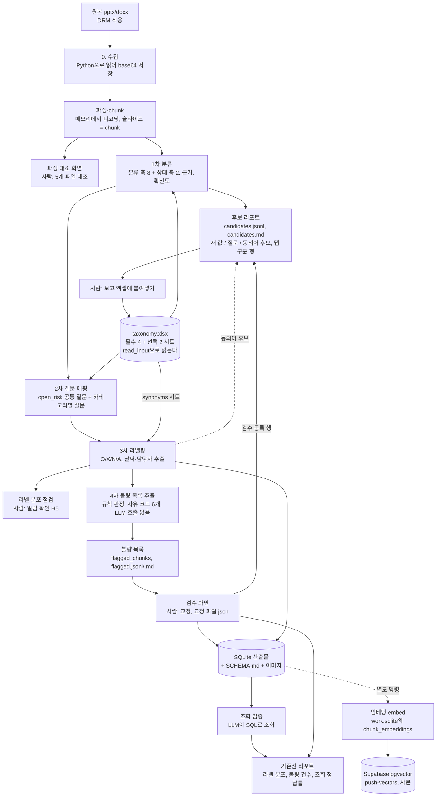
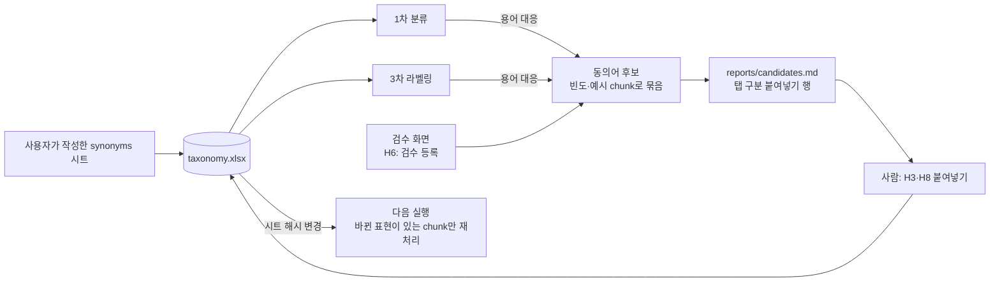

# PRD: BEOL 비정형 자료 자동 라벨링 파이프라인 MVP

- 작성일: 2026-10-04
- 상태: 초안 (구현 계획은 `plan.md`, 구현은 별도 승인 후 시작)
- 근거 자료: `note.md`, `bbogak-bot-content.md`, `data_labeling_4th.html`, 더미 pptx 세트(131개)와 정답표 대상 10개, 인터뷰 27문항(부록 A), taxonomy 재설계 스펙(`.omc/specs/deep-interview-taxonomy-redesign.md`)과 저장소 루트 `CLAUDE.md`(`PRD.md`·`plan.md`와 충돌하면 `CLAUDE.md`를 따른다)

## 1. 배경과 문제

불량이 발생하면 엔지니어는 이전 세대나 다른 제품의 유사 불량 이력을 사내 웹드라이브와 confluence에서 keyword로 찾는다. 이 검색이 조사 과정의 병목이다. 이슈 하나를 쫓을 때 파일을 5개 이상 열어본 뒤에야 맞는 파일을 찾고, 가장 큰 원인은 데이터가 정제되지 않은 자유양식의 비정형이라는 점, 다른 제품과 다른 case에서도 같은 용어를 쓴다는 점이다(`bbogak-bot-content.md:34`). 유사한 평가 이력이 담긴 파일만 제대로 찾아 주면 유사도 판단은 엔지니어가 직접 할 수 있다(`bbogak-bot-content.md:36`).

해결 방향은 자료를 chunk로 나누고, 원문에 명시되지 않은 맥락(어느 layer와 공정 이야기인지, 결과가 좋았는지, 결론이 났는지)을 라벨로 붙이는 것이다. 사람이 직접 라벨링할 수 있는 양이 아니므로 봇이 라벨링하고 사람은 일부만 검수한다(`note.md:18-22`).

## 2. 목표와 범위

### 목표

사내 파일 100개를 대상으로 아래 4단계를 봇으로 돌려, S3 drive에 올릴 DB 파일을 만든다.

1. 분류: chunk를 분류 축 8개(구조/레이어, 공정 모듈, 제품·세대, REMSPC, Patterning, Material, 불량 모드, 물리 현상)의 값과 상태 축 2개(결과, 의사결정 상태)의 값으로 분류한다.
2. 질문 매핑: open_risk 공통 질문과, 분류 결과에 맞는 카테고리별 질문을 고른다.
3. 라벨링: 질문마다 O/X/N/A로 답하고, 날짜와 담당자를 추출한다.
4. 불량 목록 추출: 3차 결과에서 unknown이 많거나 라벨링이 불량한 chunk를 LLM 호출 없이 규칙으로 골라 목록으로 내고, 사람이 검수 화면에서 교정한다.

라벨링과 별도로 임베딩 생성과 vector DB(Supabase) 적재를 한다. chunk 본문의 임베딩 벡터를 작업 DB(`work.sqlite`)의 `chunk_embeddings` 표에 보관하고, 그 사본을 Supabase(Postgres + pgvector) 표에 올린다(FR-9). 나중에 vector RAG로 갈 때 쓸 재료를 미리 만들어 두는 것이며, 라벨링 4단계는 임베딩에 의존하지 않는다.

첫 실행의 목적은 기준선 측정이다. 전 단계가 끝까지 돌고, 라벨 분포와 불량 목록의 규모, 그 DB를 LLM이 조회했을 때 답을 찾는지를 수치로 얻는다. 사내 라벨의 정확도는 측정하지 않으며, 프롬프트 변경 효과는 사외 더미 정답표 대조로만 본다.

### 범위 밖

- S3 drive 업로드 자체
- 검색 서비스와 챗봇(엔지니어에게 요약과 링크를 돌려주는 기능)
- vector 검색·RAG와 graph 구축. 어느 쪽으로 갈지는 정해지지 않았다. 임베딩 생성과 Supabase 적재는 범위 안이다(FR-9).
- 이미지 해석(VLM)
- Fab 수치 데이터(Text-to-SQL로 추출하는 정형 데이터)
- LLM이 의미 단위로 chunk를 나누는 방식. MVP는 슬라이드 단위다.
- 구형 `.ppt`/`.doc` 형식
- 월 1회 자료 갱신 운영(`bbogak-bot-content.md:100`). MVP 이후 별도 워크플로우로 다룬다.

## 3. 사용자와 운영 흐름

사용자는 PoC를 혼자 운영하는 엔지니어 1명이다.

### 3.1 운영 흐름

1. **사외 개발**: 사외에서 Claude로 코드를 작성하고 더미 샘플로 검증한 뒤 GitHub에 commit한다.
2. **반입**: 사내 컴퓨터에서 GitHub zip을 내려받아 압축을 푼다. 설치 과정 없이 그 폴더에서 바로 실행한다.
3. **사내 실행**: 업무 PC의 Python으로 사내 파일 100개에 파이프라인을 돌린다. 사람이 개입하는 지점은 3.2절을 따른다.

사외와 사내 사이에는 코드만 오간다. 사내 파일, 사내 taxonomy, DB, 로그는 사외로 나오지 않는다.

### 3.2 Human in the loop 지점

사람이 판단하거나 확인하는 지점은 아래가 전부다. 파이프라인이 사람의 처리를 기다리는 지점은 "대기", 사람의 처리와 관계없이 계속 진행하는 지점은 "계속"으로 표시한다.

| # | 시점 | 사람이 하는 일 | 화면·수단 | 진행 |
|---|---|---|---|---|
| H1 | 실행 전 | 파일 목록에서 대상 파일을 확인하고, 맥락이 부족한 파일에 메모를 적거나 제외한다(`bbogak-bot-content.md:112`). 메모와 제외는 `taxonomy.xlsx`의 선택 시트 `files`에, 직접 만든 동의어는 `synonyms` 시트에 적는다(6.2절). 봇은 새 파일을 `reports/file_list.md`에 붙여넣기 행으로 낸다. | `taxonomy.xlsx`(`files`·`synonyms` 시트), `reports/file_list.md` | 대기 |
| H2 | 파싱 후 | 파일 5개를 원본과 나란히 대조한다. 선택 단계이며, 검수(H6)를 시작할 때 이번에 할지 묻고 하겠다고 하면 검수 화면과 함께 연다. | 파싱 대조 화면 | 계속 |
| H3 | 1차 분류 후 | 봇이 올린 새 값 후보를 보고 값으로 쓸지, 동의어로 쓸지, 기각할지 정해 `taxonomy.xlsx`에 붙여넣는다. 기각한 후보는 `rejected` 시트에 적는다. | `reports/candidates.md`, `taxonomy.xlsx` | 계속(처리 전 후보는 `unknown`으로 둔다) |
| H4 | 2차 질문 후보 생성 후 | 질문 후보를 보고 승인할 것을 `questions` 시트에 붙여넣고, 필요하면 문장을 고친다. 승인된 질문이 없으면 3차를 시작하지 않는다(FR-3). | `reports/candidates.md`, `taxonomy.xlsx`(`questions` 시트) | 대기 |
| H5 | 라벨링 중·후 | 라벨 분포가 아래 조건에 걸리면 알림을 받고, 프롬프트·질문·taxonomy·동의어 시트를 점검한다. | 콘솔 경고, 알림 파일, 기준선 리포트 | 계속 |
| H6 | 라벨링 후 | 불량 목록의 chunk를 검수한다. 건수는 실행마다 다르고 사유 코드 필터로 우선순위를 정한다. 검수 중 발견한 동의어는 교정 파일(`.json`)에 담기고, 후보 리포트의 "검수 등록" 행으로 나온다. taxonomy가 내용을 담지 못하는 축·질문은 재검토 요청(사유 코드, 제안 값, 메모 500자)으로 남기며, `reports/taxonomy_revisit.md`로 나온다. 다 끝나면 검수 화면의 "검수 완료" 버튼을 누르고(교정이 없어도 누른다), 그 신호로 반영·임베딩·적재가 이어진다. | 검수 화면, `reports/taxonomy_revisit.md` | 대기(검수 완료 버튼까지) |
| H7 | 산출 후 | 봇이 `reports/query_candidates.md`에 올린 조회 질문 후보 중 검증에 쓸 질문을 `queries` 시트에 붙여넣고 채택 열을 Y로 둔다. | `reports/query_candidates.md`, `taxonomy.xlsx`(`queries` 시트) | 대기 |
| H8 | 1차 분류 후, 라벨링 후 | 봇이 올린 동의어 후보를 보고 승인할 것을 `synonyms` 시트에 붙여넣는다. 시트에 옮긴 동의어는 다음 실행부터 쓰인다(6.2절). | `reports/candidates.md`, `taxonomy.xlsx`(`synonyms` 시트) | 계속(처리 전 후보는 시트에 넣지 않는다) |

**H5 라벨 분포 알림 조건**

아래 중 하나라도 해당하면 사람에게 알린다. 두 조건 모두 1회 실행 단위로, 내용 유형 chunk만 대상으로 계산한다.

1. 3차 라벨링 답 중 N/A의 비율이 30% 이하다. 질문이 chunk에 맞지 않는데도 봇이 O나 X를 억지로 고르고 있을 수 있다는 신호다.
   - 비율 = N/A인 답 수 / 전체 답 수. 라벨 실패 chunk(FR-4)는 분모에서 빼고 실패 수를 따로 기록한다.
2. 분류 축 중 다중값=Y이고 중복 알림 제외=N인 축의 라벨 40% 이상이 중복 라벨링이다. 중복 라벨링은 한 chunk의 같은 축에 값이 두 개 이상 붙은 경우를 말하며, 축 값의 경계가 모호하거나 봇이 값을 고르지 못하고 있다는 신호다. 결과 축(중복 알림 제외=Y)과 다중값=N인 축은 집계에서 뺀다.
   - 비율 = 같은 chunk·같은 축에 값이 두 개 이상 붙은 라벨 수 / 전체 라벨 수. 분모와 분자에서 `unknown`과 `해당 없음`을 뺀다. 상위값과 하위값이 함께 나오면 하위값만 저장하므로(gap-fill) 계층 축의 상위·하위 동시 부여는 중복으로 세지 않는다.

알림은 세 곳에 남긴다.

- 해당 명령이 끝날 때 콘솔에 경고로 출력한다. 수치와 기준값만 출력하고 문서 본문은 넣지 않는다(9.3절).
- 작업 폴더의 `reports/alerts.json`에 실행 ID, 조건, 수치, 기준값을 기록한다.
- 기준선 리포트 첫머리에 표시한다.

실행 도중에도 N/A 비율을 일정 건수마다 다시 계산해, 조건에 걸리면 그 시점에 한 번 경고를 출력한다. 진행은 멈추지 않는다. 사람이 원인을 보고 프롬프트나 질문을 고친 뒤 재실행하면, 바뀐 부분만 다시 처리된다(9.4절). 기준값 30%와 40%는 설정 파일에서 바꿀 수 있다.

## 4. 파이프라인 흐름도

임베딩과 벡터 적재(FR-9)는 산출 뒤의 별도 단계다. `run`은 두 명령을 부르지 않는다. 실패해도 라벨링과 산출을 막지 않는다.

슬라이드 미리보기 JPG(`slide-images`)와 그 Storage 적재(`push-slides`)도 같은 성격의 별도 단계다. 검수 화면과 같은 근사 미리보기를 슬라이드(=chunk)마다 JPG로 만들어 `.b64`로 보관하고, Supabase Storage `BEOL-labeling` 버킷에 올린 뒤 벡터 행에 어떤 JPG인지(`slide_image_*`)를 기록한다. 라벨과 `label_hash`는 바꾸지 않는다.

## 5. 기능 요구사항

### FR-0. 수집

- 원본 파일을 Python으로 읽어 base64 텍스트 파일로 저장한다. 사내 파일은 DRM이 걸려 있고, 업무 PC에서 Python이 읽으면 풀린 내용이 나온다는 것을 사용자가 확인했다.
- 파일마다 원본 바이트의 해시를 기록해 파일 ID로 쓴다. 해시가 같은 파일은 중복으로 표시하고 한 번만 처리한다.
- 파일마다 입력 루트 기준 상대 경로(구분자 `/`, NFC)와 파일명을 기록한다. 경로는 ingest 시점에만 알 수 있고, 엔지니어가 원본을 찾아가려면 필요하므로 필수다. 같은 해시가 여러 폴더에 있으면 위치를 모두 `file_locations` 표(파일 ID, 상대 경로, 파일명, 처음 본 실행, 마지막으로 본 실행)에 남기고, files에는 파일명과 대표 경로 `rel_path`를 NOT NULL로 둔다. 시그니처 불일치나 `OLE_LEGACY`로 실패한 파일도 `file_locations`에 기록한다. 로그에는 파일 ID만 남으므로 이것이 없으면 실패 목록에서 원본을 찾을 수 없다. 입력 루트 절대 경로는 작업 DB의 실행 메타에만 한 번 둔다.
- 수집 후 파일이 다른 폴더로 옮겨져도 해시가 같으면 위치 행만 늘고, 파싱·분류·라벨링은 다시 하지 않는다.
- 이후 모든 단계는 base64 파일만 읽는다. 디코딩한 pptx/docx 바이트는 메모리에서만 다루고 디스크에 쓰지 않는다.
- 디코딩 직후 시그니처로 판정한다. pptx·docx·xlsx는 `PK\x03\x04`로 시작해야 하며, 아니면 사유 코드 `NOT_OOXML`로, `D0 CF 11 E0`로 시작하면(DRM이 풀리지 않은 암호 파일) `ENCRYPTED`로, 구형 OLE 형식이면 `OLE_LEGACY`로 실패 목록에 넣고 나머지를 계속 처리한다.
- `files` 시트에서 제외=Y로 표시된 파일은 처리하지 않는다.
- 사람이 만든 입력(`taxonomy.xlsx`, `inbox/`의 교정 `.json`)도 같은 규칙을 따른다. `ingest.read_input(path, snapshot_dir)` 한 곳에서만 `open(path,"rb")`로 읽고 시그니처를 확인한 뒤, `snapshot_dir`이 있으면 `inputs/<sha256>.b64`로 보관하고(같은 해시는 재사용) 다른 모듈에는 이 bytes만 넘긴다. `snapshot_dir`이 `None`이면 보관하지 않는다. 텍스트 입력은 `utf-8-sig`로 먼저 읽고 실패하면 `cp949`로 읽는다.

### FR-1. 파싱과 chunk

- pptx는 슬라이드 1장을 chunk 1개로 만든다. 슬라이드 순서는 `presentation.xml`의 순서를 따른다.
- docx는 제목 스타일 단위 섹션을 chunk 1개로 만든다. 제목 스타일이 없으면 일정 길이로 나눈다. 대상 파일 대부분이 pptx이므로 docx는 기본 수준으로 둔다.
- chunk 방식은 설정으로 교체할 수 있는 구조로 만든다. 방식을 바꿔도 1~4차 단계의 코드는 바뀌지 않는다.
- chunk 텍스트 구성 규칙은 7.1절을 따른다.
- 이미지는 추출해 chunk와 연결한다. 같은 이미지(해시 기준)는 한 번만 저장하고, 최소 크기 미만이거나 파일 내 여러 슬라이드에 반복되는 장식 이미지는 제외한다. 이미지는 `.b64`로 저장한다(`CLAUDE.md`의 쓰기 규칙). 화면에는 HTML을 생성할 때 data URL로 넣는다.
- 차트는 차트 XML에서 제목, 계열 이름, 범주 이름을 읽어 `[차트]` 구간으로 chunk에 넣는다(필수). 수치 값은 넣지 않는다. 파싱이 바뀌면 chunk 본문과 이후 모든 호출이 바뀌어 기준선과 비교할 수 없으므로 첫 실행 전에 넣는다.
- 정규화한 본문 해시로 chunk마다 `dup_group`을 붙인다. 같은 본문의 chunk가 여러 파일에 있어도 처리는 바꾸지 않고 표시만 하며, 모두 끝까지 처리해 산출에 남긴다. 검수 화면의 묶음 표시(FR-5, FR-7)와 리포트의 중복 비율에 쓴다.
- 문서 속성(작성자, 작성 일시)을 읽어 파일 단위 값으로 저장한다.
- 파싱 중 이상(텍스트가 거의 없음, 그룹 도형·SmartArt 등 처리하지 못한 요소가 있음)은 chunk에 경고로 기록한다.

### FR-2. 1차 분류

- chunk마다 분류 축 8개(구조/레이어, 공정 모듈, 제품·세대, REMSPC, Patterning, Material, 불량 모드, 물리 현상)와 상태 축 2개(결과, 의사결정 상태)의 값을 한 번의 호출에서 낸다. 근거 문장, 확신도(0~1), chunk 유형(내용, 표지, 목차, 참고문헌)도 함께 낸다.
- 축과 값은 `taxonomy.xlsx`의 `taxonomy` 시트에서 읽으며(6.1절), 코드에 고정하지 않는다. 사용 여부=N인 값은 없는 값으로 본다.
- 축마다 아래 셋 중 하나 이상을 낸다. 다중값=N인 축(의사결정 상태)은 정확히 하나이며, `해당 없음`과 `unknown`도 그 하나로 센다.
  - 값: taxonomy에 있는 값
  - `해당 없음`: 이 chunk는 그 축과 무관하다.
  - `unknown`: 그 축과 관련은 있으나 맞는 값이 없거나 판단할 수 없다.
- 축별 판정 규칙은 다음과 같다.
  - REMSPC: 변경·평가한 변수의 범주와 불량·이슈 원인의 범주를 모두 붙인다. 값이 변경인지 원인인지 표시하는 열은 두지 않는다.
  - 계층 축(불량 모드): 하위값이 불분명하면 상위값만 붙인다. 상위값과 하위값이 함께 나오면 하위값만 저장한다(gap-fill).
  - 결과: 한 chunk에서 조건별 결과가 엇갈리면 해당 값을 모두 붙인다.
  - 의사결정 상태: 채택된 조건이 하나라도 있으면 adopted, 모든 조건이 기각되면 rejected, 평가는 있으나 결론이 적혀 있지 않으면 pending, 평가 내용이 없으면 `해당 없음`이다.
- 응답의 축 키 집합이 활성 축 집합과 정확히 같아야 통과한다. 빠진 축에 `해당 없음`이나 `unknown`을 자동으로 채우지 않는다. 빠진 축이 있으면 재시도하고, 그래도 빠지면 그 chunk는 "분류 실패"로 실패 목록에 넣으며 `facet_labels`에 행을 만들지 않고 2~3차를 호출하지 않는다. 모르는 축 키는 버리고 사유 코드를 남긴다. 빈칸을 채우면 지표가 오염되고, 실패 chunk를 조용히 빼면 수치가 좋게 나오기 때문이다.
- 활성 값이 0개인 축(기본본의 제품·세대)은 LLM에 묻지 않고 `해당 없음`으로 저장하며, `meta`에 비활성 축으로 적는다(gap-fill). 비활성 축은 unknown 비율, `UNKNOWN_HIGH` 판정(FR-5), H5 계산에서 빼고 리포트에 "비활성"으로 표시한다. 0/0이나 의미 없는 100%가 나오지 않게 하기 위해서다.
- 분류 프롬프트에는 chunk 본문과 함께 파일명, 문서 제목, 그 파일의 슬라이드 제목 목록, 파일의 수동 맥락 메모(`files` 시트)를 넣는다.
- 분류 프롬프트에는 파일의 상대 경로도 "참고(인용 불가)"로 넣는다. 폴더명에 제품·세대 단서가 있는 경우가 많기 때문이다. 대표 경로가 아니라 처음 본 위치(`file_locations`에서 처음 본 실행의 상대 경로)를 고정해서 넣으므로, 파일을 옮겨도 프롬프트와 캐시 키가 바뀌지 않는다. 입력 루트 절대 경로는 넣지 않는다. 근거는 본문에서만 받는다.
- 본문의 용어는 `synonyms` 시트(6.2절)로 표준 값에 맞춘 뒤 taxonomy와 대조한다.
- 시트에 없는 본문 표현을 taxonomy 값과 같은 뜻으로 판단했으면, 응답에 용어 대응(본문 표현, 표준어, 근거)으로 함께 낸다. 이것은 동의어 후보가 된다.
- taxonomy에 없는 값은 라벨로 저장하지 않는다. 해당 축은 `unknown`으로 두고, 그 값을 빈도와 예시 chunk와 함께 새 값 후보로 올린다.
- 내용 유형이 아닌 chunk(표지, 목차, 참고문헌)는 2~3차에서 제외한다.

### FR-3. 2차 질문 후보 생성과 매핑

- LLM이 1차 결과를 훑어 질문 후보를 제안한다. 후보는 두 종류다.
  - 공통 질문: 모든 chunk에 묻는다. 결과와 의사결정은 상태 축으로 옮겼으므로, 공통 질문은 `questions` 시트의 open_risk O/X 1개(`Q-COM-001`, 아직 해결되지 않은 위험이 명시되어 있는가)다.
  - 카테고리별 질문: 특정 축 값에 해당하는 chunk에만 묻는다.
- 후보는 `reports/candidates.md`로 나오고, 사람이 `questions` 시트에 옮겨 적으면 승인된 것으로 본다. 옮겨 적으면서 문장을 고칠 수 있다.
- 매핑은 규칙으로 한다. chunk에는 공통 질문 전부와, chunk의 축 값에 해당하는 카테고리별 질문이 붙는다. chunk당 질문 수에 상한을 두고 초과하면 우선순위 순으로 자른다.
- 우선순위는 숫자가 작을수록 먼저 들어간다(1이 가장 먼저). 같은 숫자면 질문 ID 오름차순이다. 공통 질문은 우선순위 상위에 두어 잘리지 않게 한다. 방향에 따라 상한에서 남는 질문이 바뀌어 3차 호출 집합과 기준선이 달라지므로 명시한다. 잘린 횟수는 질문별로 리포트에 낸다.
- 검수에서 분류를 교정하면 그 chunk의 2차를 다시 하고 3차를 chunk 단위로 다시 호출한다. 매핑이 해제된 답 중 사람이 교정하거나 확인한 답은 보존해 산출 `answers`에 "매핑 해제(사람 값)"로 남기고, 봇 답만 있던 것은 뺀다.
- 승인된 질문이 하나도 없으면 3차를 시작하지 않고 안내와 함께 멈춘다.

### FR-4. 3차 라벨링

- chunk당 한 번 호출해, 매핑된 질문마다 O/X/N/A, 근거 인용, 확신도를 받는다. 판정 규칙은 7.2절을 따른다.
- 같은 호출에서 chunk 본문에 적힌 날짜와 담당자를 추출한다. 규칙은 7.3절을 따른다.
- 응답은 매핑된 질문 전부에 답해야 통과한다. 빠진 질문이 있으면 재시도하고, 그래도 빠지면 그 chunk는 "라벨 실패"로 실패 목록에 넣으며 빠진 칸을 N/A로 채우지 않는다. 매핑되지 않은 질문 ID의 답은 버리고 사유 코드를 남기며, 같은 질문에 두 번 답하면 형식 오류다.
- 라벨링 프롬프트에는 "참고(인용 불가)" 구간을 두고 파일 제목, 슬라이드 제목, 앞뒤 슬라이드 제목, 1차 축 값을 넣는다. 앞뒤 슬라이드 본문은 넣지 않는다. 결론 슬라이드가 앞 슬라이드의 실험을 가리킬 때와 카테고리 질문을 축 값과 함께 해석할 때를 위해서다. 근거 인용은 그 chunk 본문에서만 받는다.
- 라벨링 프롬프트에는 그 chunk 본문에서 일치한 `synonyms` 시트 항목을 "본문 표현 → 표준어" 목록으로 넣는다. 질문은 표준어로 쓰여 있으므로, 본문이 다른 표현을 써도 같은 대상으로 판단하게 하기 위해서다.
- 시트에 없는 본문 표현을 질문의 용어와 같은 뜻으로 판단했으면, 1차와 같은 형식의 용어 대응으로 낸다. 이것은 동의어 후보가 된다.
- 결과에는 `taxonomy`·`synonyms`·`questions` 시트 해시(9.4절), 프롬프트 버전, 모델명을 함께 기록한다.
- 라벨링 도중과 끝난 뒤에 N/A 비율과 중복 라벨링 비율을 계산해, 3.2절 H5 조건에 걸리면 사람에게 알린다.

### FR-5. 4차 불량 목록 추출

- 3차 라벨링 결과에서 unknown이 많거나 라벨링이 불량한 chunk를 골라 목록으로 따로 낸다. 판정은 LLM 호출 없이 work.sqlite에 이미 있는 값(분류·라벨 원답, 확신도, 근거 인용, 파싱 경고, 실패 목록)으로만 한다.
- 사유 코드는 아래 6개다. 한 chunk에 여러 개가 걸릴 수 있다.
  - `UNKNOWN_HIGH`: 활성 분류 축 중 `unknown`인 축의 비율이 `flag.unknown_ratio_min`(기본 0.5) 이상이다. 비율 = `unknown`인 축 수 / (활성 분류 축 수 − `해당 없음`인 축 수). 비활성 축과 `해당 없음`은 분모에서 뺀다. 분모가 0이면 걸지 않는다.
  - `LOW_CONFIDENCE`: 그 chunk의 답(축 값과 질문 답) 중 확신도가 `flag.confidence_min`(기본 0.7) 미만인 것이 있다.
  - `QUOTE_NOT_FOUND`: 근거 인용이 정규화(NFKC, 공백 축약, 대시 문자 통일) 후에도 chunk 본문에 없다. "A … B"처럼 생략한 인용은 조각이 순서대로 본문에 있을 때만 일치로 본다. 짧은 인용(한글 2자 이하, 영숫자 4자 이하)은 거의 항상 통과하므로 약신호로 기록만 하고 사유 코드로 올리지 않는다.
  - `PARSE_WARNING`: 그 chunk에 파싱 경고(FR-1)가 있다.
  - `CLASSIFY_FAILED`: 1차 분류가 실패했다(FR-2).
  - `LABEL_FAILED`: 3차 라벨링이 실패했다(FR-4). 분류·라벨 실패를 `해당 없음`이나 N/A로 숨기지 않는 규칙은 그대로다.
- 걸린 chunk는 상한 없이 전부 낸다. 산출은 세 곳이다.
  - 작업 DB 표 `flagged_chunks(run_id, chunk_id, reason_codes, unknown_ratio, min_confidence, text_hash)`. `reason_codes`는 정렬한 사유 코드 목록의 JSON이다.
  - `reports/flagged_<실행ID>.jsonl`: 한 줄에 chunk 하나. chunk ID, 파일 ID, 사유 코드, `unknown_ratio`, `min_confidence`만 넣는다.
  - `reports/flagged_<실행ID>.md`: 사유 코드별 건수 요약과 위 목록.
  - 두 파일에는 본문, 파일명, 경로를 넣지 않는다(9.3절).
- 같은 실행 ID와 같은 `flag` 설정으로 다시 돌리면 같은 목록이 나온다.
- `python -m labelbot review`가 `flagged_chunks`와 두 파일을 만들고, 그 목록 전부를 `screens/review.html`에 올린다(FR-7). 사유 코드가 많이 겹친 순으로 정렬하고, 사유 코드별로 거를 수 있다. `dup_group`이 같은 chunk는 묶어서 보여 주되 교정은 chunk별로 한다. 실패 chunk는 봇 값 없이 판정 칸만 나온다(분류 실패면 축 값과 `Q-COM-001`만).
- 사람이 교정한 값이 최종 라벨이 된다. 교정은 재실행해도 덮어쓰지 않으며, 교정된 chunk의 봇 원답은 작업 DB `corrections`에 남긴다.
- 리포트는 `report --run <실행ID>`로 특정 실행 기준으로 다시 낼 수 있고, work.sqlite만으로 LLM 호출 없이 다시 계산된다. 사내 리포트에는 분포만 낸다.
  - 축별 `unknown / (전체 − 해당 없음)` 비율(비활성 축은 "비활성"으로 표시), 질문별 O/X/N/A 분포, N/A 편중 질문 표시(n≥20이면서 N/A가 95% 이상이거나 5% 이하), 중복 라벨링 비율, H5 알림 여부
  - 사유 코드별 불량 건수와 전체 내용 chunk 대비 비율, 실패 chunk 수, `dup_group` 중복 비율, 교정 건수
- 사내 리포트는 정확도 지표를 내지 않는다. 사내 라벨의 정확도는 측정하지 않고, 프롬프트 변경 효과는 사외 더미 정답표 대조로만 본다. 사외 대조 도구 `tools/evalgold.py`는 더미 정답표 `tests/gold/gold_labels.jsonl`과 봇 결과를 비교하며, 지표(축별 완전 일치율, Jaccard, 혼동 행렬) 계산은 `labelbot/metrics.py`에 둔다. 사내 `report`는 `metrics.py`의 이 지표를 부르지 않는다.

### FR-6. 산출과 조회 검증

- SQLite 파일 하나, 스키마 설명 문서(`SCHEMA.md`), 이미지 폴더를 산출한다. 구성은 8절을 따른다.
- LLM이 chunk를 보고 조회 질문 후보(자연어 질문과 기대 정답 파일·chunk)를 제안해 `reports/query_candidates.md`에 붙여넣기 행으로 낸다. ID는 `QRY-` + 정규화(NFKC·소문자·공백 축약) 문장의 sha256 앞 8자로 만들어, 재실행해도 같다. 사람은 검증에 쓸 질문을 `queries` 시트에 붙여넣고 채택 열을 Y로 둔다.
- 채택=Y인 질문마다 LLM이 `SCHEMA.md`를 보고 SQL을 만들고, 그 SQL을 읽기 전용으로 실행해 결과에 기대 정답이 들어 있는지 판정한다.
- 리포트에 질문별 SQL, 결과 건수, 정답 포함 여부, 전체 조회 정답률이 나온다.
- 결과 건수가 K(기본 20)를 넘으면 정답을 포함해도 "과다 결과"로 판정한다. 수백 건을 돌려주고 맞았다고 세지 않기 위해서다. SQL 실행 실패는 라벨 실패와 따로 센다.
- 질문마다 라벨 스키마 SQL과 라벨 제거 스키마(files, `file_locations`, chunks만) SQL의 판정을 나란히 낸다. 라벨이 keyword 조회보다 나은지 답하기 위한 대조군이며, 두 경로 모두 읽기 전용 단일 SELECT다.
- 채택 질문이 10개 이하이면 조회 정답률 전체에 "참고"를 붙인다.

### FR-7. 로컬 HTML 화면

두 화면 모두 서버 없이 파일을 열어 쓸 수 있고, 표시할 데이터와 이미지(data URL)는 HTML 파일 안에 들어 있다. 화면에서 한 작업은 `.json` 파일로 내려받아 `inbox/`에 넣고 `apply` 명령으로 적용한다. 내려받기가 막힌 환경을 위해 같은 내용을 텍스트로 복사하는 방법도 둔다.

로컬 화면 서버(`labelbot serve`, 127.0.0.1 전용)로 열면 체크할 때마다 `inbox/`에 바로 저장된다. 이때 검수 화면에 "검수 완료" 버튼이 보인다. 버튼을 누르면 마지막 교정을 `inbox/review_<실행ID>.json`에 저장한 뒤 완료 신호 `signals/review_done_<실행ID>.json`을 쓰고, 검수 반영 스킬이 이 신호를 보고 반영·임베딩·적재로 넘어간다. 신호에는 실행 ID, 시각, 건수만 넣고 교정 본문·메모는 넣지 않는다. 파일로 연 화면과 예전 서버에는 이 버튼이 없으며, 사람이 검수가 끝났다고 알리면 같은 절차로 이어간다. 파싱 대조 화면에는 완료 버튼이 없고, 검수 완료로 함께 마감한다.

taxonomy는 화면이 아니라 `taxonomy.xlsx`를 Excel에서 직접 고친다(6.1절). 화면에서 하는 일은 파싱 확인, 검수 교정, taxonomy 재검토 요청뿐이다(시트 수정은 여전히 Excel에서 한다).

| 화면 | 하는 일 |
|---|---|
| 파싱 대조 화면 | 파일별로 슬라이드 순서대로 제목, 본문, 표, 노트, 이미지 목록을 보여준다. 원본과 비교해 슬라이드마다 이상 여부와 메모를 기록한다. |
| 검수 화면 | `review` 명령이 만든 불량 목록(`flagged_chunks`) 전부를 상한 없이 올린다. 사유 코드가 많이 겹친 순으로 정렬하고, chunk마다 사유 코드와 수치(`unknown_ratio`, `min_confidence`)를 보여주며, 사유 코드별 필터를 둔다. `dup_group`이 같은 chunk는 묶어서 보여 주되 교정은 chunk별로 한다. chunk 본문(근거 인용 강조), 이미지, 분류 결과(값, `해당 없음`, `unknown`의 3상태와 계층 값), 질문별 답과 확신도, 추출된 날짜·담당자, 대표 상대 경로, 파일명과 슬라이드 번호를 보여준다. 축 값마다 `taxonomy` 시트의 정의·판정 규칙을 함께 보여준다. 본문에서 `synonyms` 시트와 일치한 표현을 표시한다. 답과 분류를 교정하고, "확인, 이상 없음"과 "판단 불가: 정보가 이미지에만 있음"을 기록할 수 있다. 본문 표현을 골라 표준어를 지정하면 교정 파일에 담겨, 후보 리포트의 "검수 등록" 행으로 나온다. 축·질문마다 taxonomy 재검토 요청을 남길 수 있다(사유 코드 `NO_FIT_VALUE`·`AMBIGUOUS_DEF`·`VALUE_OVERLAP`·`NEED_QUESTION`·`NEW_AXIS`·`OTHER`, 제안 값, 메모 500자). 새 축 제안과 필요한 질문 제안도 같은 방식이며, 저장한 요청은 삭제(취소)할 수 있다. 축에 `NO_FIT_VALUE` 요청이 있는데 값이 `unknown`이 아니면 "맞는 값이 없다면 unknown으로 교정하세요" 안내를 보여준다. 재검토 요청은 라벨을 바꾸지 않는다. 진행 상황은 브라우저에 자동 저장한다. chunk당 표시하는 이미지 수에 상한(기본 4개, 설정으로 조정)을 둔다. |

교정 파일에는 검수 화면을 만든 실행 ID가 들어간다. `apply`는 그 실행 ID의 `flagged_chunks`가 있으면 이후에 재실행했더라도 반영하고, 없으면 그 교정 파일을 거부한다. 그 뒤 본문(`text_hash`)이나 질문 문장이 바뀐 chunk의 교정은 반영하되 재검수 대상으로 표시한다. 같은 파일을 여러 번 반영해도 결과가 같다. 교정이 반영되면 사람 값이 최종 라벨이 되고 봇 원답은 `corrections`에 남는다. 라벨이 바뀐 chunk만 `label_hash`가 달라져 Supabase에 다시 올라간다(FR-9). 교정 파일에는 경로와 파일명을 넣지 않는다. 재검토 요청은 라벨과 `label_hash`를 바꾸지 않으므로 Supabase 재적재가 없다. 교정 파일의 `revisits` 배열이 있으면 그 실행의 요청 전체를 대신하고(빈 배열이면 전부 취소), 키가 없는 예전 파일은 그 실행의 요청을 건드리지 않는다. 같은 `(chunk, 대상, 키)`는 1건이며, 불량 목록 밖 chunk와 형식이 틀린 요청은 사유 코드(`REVISIT_*`)와 건수만 보고하고 버린다. 요청 항목 하나가 잘못되어도 같은 파일의 교정 반영은 유지되고, 교정 파일 하나가 `FORMAT_INVALID`여도 파일별 `SAVEPOINT`로 다른 파일의 반영은 되돌리지 않는다.

### FR-8. 점검 도구

- **self-check**: Python 버전, sqlite3 사용 가능 여부, 작업 폴더 쓰기 권한, 작업 폴더의 `taxonomy.xlsx` 존재, LLM 주소 접속과 응답 형식을 항목별 PASS/FAIL로 출력한다. 아래 두 항목도 낸다.
  - `write_roundtrip`: 작업 폴더의 임시 하위 폴더에 파이프라인이 쓰는 확장자마다(`.b64 .sqlite .json .jsonl .html .md .log`) 알려진 바이트를 쓰고 다시 읽어 sha256을 비교한 뒤 지운다. `.sqlite`는 `PRAGMA integrity_check`와 SELECT까지 확인한다. 원본 경로를 열지 않으므로 `read_input` 단일 경로 규칙의 예외다. 같은 PC의 Python은 투명하게 복호화하므로 이 항목은 필요조건일 뿐이며, 출력에 "필요조건일 뿐이며 M7 게이트의 수동 확인이 필요하다"는 문구를 넣는다.
  - 호스트 판정: `llm`·`embedding`·`supabase` 블록의 주소가 사내/사외/불확실 중 무엇으로 판정되는지 출력한다(9.3절).
- **사내 반입 게이트**: 100개 실행 전에 사내에서 G-1~G-10 게이트를 확인한다(절차는 `plan.md` M7). 허용 형식으로 쓴 파일에도 DRM이 다시 걸리면 방식 전체가 무너지므로, 같은 PC의 메모장·브라우저 확인은 필요조건으로만 쓰고, 사외로 반출하는 형식은 실제 반출 경로를 거친 뒤나 DRM 에이전트가 없는 PC에서 열어 확인한다(G-10). `python -m labelbot gate record`로 항목별 PASS/FAIL을 입력해 `reports/gate_<timestamp>.json`에 남긴다. self-check와 게이트는 실행 ID를 발급하지 않으므로 시각을 쓴다. 경로와 파일명은 넣지 않는다. 게이트가 FAIL이면 100개 실행을 시작하지 않는다.
- **점검 스크립트**: 대상 파일의 구조 통계만 출력한다(zip으로 열리는지, 슬라이드 수, 그룹 도형·차트·SmartArt·숨김 슬라이드 수, docx 제목 스타일 사용 여부). 문서 본문은 출력하지 않는다. 이 결과로 파서가 감당할 범위를 확정한다.

### FR-9. 임베딩과 벡터 적재

- **범위**: chunk 임베딩 벡터를 만들어 작업 DB `work.sqlite`의 `chunk_embeddings` 표에 보관하고, 그 벡터를 Supabase(Postgres + pgvector) 표에 올리는 데까지다. 검색, RAG, graph는 만들지 않는다. 로컬 `chunk_embeddings`가 원본이고 Supabase 표는 사본이다.
- **단계**: 임베딩(`python -m labelbot embed`)과 적재(`python -m labelbot push-vectors`)는 chunk와 라벨이 확정된 뒤 따로 도는 명령이다. `run`은 두 명령을 부르지 않는다. 분류·라벨링·검수는 임베딩에 의존하지 않는다. 임베딩이나 적재가 실패하면 사유 코드로 기록하고 라벨링과 산출을 막지 않는다.
- **임베딩 호출**: `urllib` 기반 OpenAI Embeddings 호환 API(`POST {base_url}{path}`)를 쓴다. 설정은 `pipeline.json`의 `embedding` 블록이다(9.1절). 입력은 chunk의 파싱된 텍스트이며 base64 문자열은 넣지 않는다(`CLAUDE.md` DRM 규칙). 호스트 판정, 더미 해시 조건, 리다이렉트 거부, 키 비노출은 LLM 호출과 같은 공용 함수를 쓴다(9.3절).
- **임베딩 저장**: `chunk_embeddings(chunk_id, model, dim, text_hash, vector, run_id)`이며 벡터는 float32로 직렬화한 BLOB이다. `text_hash`와 `model`이 같으면 다시 호출하지 않는다. 모델마다 차원이 다르므로 모델이 다른 벡터는 같은 조회에서 섞지 않고, 모델을 바꾸면 그 모델로 다시 만든다.
- **적재 호출**: `push-vectors`는 `urllib`로 `POST {url}/rest/v1/{table}`을 부르며, 헤더는 `apikey`, `Authorization: Bearer`, `Prefer: resolution=merge-duplicates`이고 chunk ID와 모델 기준으로 upsert한다. `batch_size`개씩 묶어 보내고, 리다이렉트는 따라가지 않는다. 키는 `supabase.key_env`가 가리키는 환경변수에서만 읽고 설정, 로그, 캐시, DB에 넣지 않는다. 모델이 다른 벡터를 같은 표에 섞어 올리려 하면 거부한다. 보낼 대상이 0개면 호출이 0회다.
- **보내는 열**: chunk ID, 파일 ID(sha256), chunk 순번, 모델, 차원, 벡터, chunk 본문, 확정 라벨(JSON 값), 실행 ID. 파일명과 경로는 보내지 않는다. 확정 라벨은 검수 교정이 있으면 교정 값, 없으면 봇 값이다.
- **사외 전송 조건**: `supabase.url`의 호스트를 LLM 호출과 같은 방식으로 판정한다. 호스트가 `internal_host_suffixes`에 맞지 않으면 사외이고, 사외에는 파일 해시가 더미 해시 목록(`tests/gold/dummy_hashes.jsonl` 또는 사외 검증 폴더 `parshing test files/`(저장소 상대 경로, `llm.DUMMY_DIRS`)의 현재 파일 해시)에 있는 chunk만 보낸다. 나머지 chunk는 보내지 않고 사유 코드를 남긴다. 판정이 불확실하면 보내지 않는다.
- **멱등**: 작업 DB에 `vector_push_log(chunk_id, model, text_hash, label_hash, target_host_hash, pushed_at, result_code)`를 둔다. `label_hash`는 `{축 ID: 정렬한 값 목록, 질문 ID: 답}`만 넣어 키 순으로 정렬한 JSON의 sha256이며 확신도, 근거, 검수 상태, 시각은 넣지 않는다(정의는 `plan.md` 2절 "ID와 해시 정의"). 라벨 실패 chunk는 적재하지 않는다. 같은 대상 호스트에 같은 chunk ID·모델·`text_hash`·`label_hash`가 이미 성공으로 기록되어 있으면 다시 보내지 않으므로, 같은 내용으로 재실행하면 호출이 0회다. 검수 교정으로 확정 라벨이 바뀌면 `label_hash`가 달라지므로 그 chunk만 다시 올린다(upsert). 이 표에도 본문, 파일명, 키를 넣지 않는다.
- **Supabase 표 정의**: 표 이름, 열, pgvector 차원(임베딩 모델 차원과 같아야 한다), 충돌 키는 저장소의 `docs/supabase_schema.md`에 SQL 코드 블록으로 둔다. `.sql`은 `CLAUDE.md` 쓰기 규칙의 허용 목록에 없으므로 `.md`로 쓴다. 봇은 Supabase 표를 만들거나 지우지 않는다.

## 6. taxonomy와 동의어 시트 운영 규칙

### 6.1 taxonomy.xlsx

- 사람이 고치는 원본은 `taxonomy.xlsx` 하나다. 분류 축·값, 질문, 동의어, 기각 이력을 담는 필수 시트 4개(`taxonomy`, `questions`, `synonyms`, `rejected`)와, 파일 메모·제외와 조회 질문 채택을 담는 선택 시트 2개(`files`, `queries`)로 이루어진다. 사용자는 Excel로만 고치며 코드를 수정할 필요가 없다. 봇은 엑셀을 읽고 검증하기만 하고 쓰지 않는다. 후보 승인도 사람만 한다.
- 1행 머리글은 아래 문자열과 순서가 정확히 같아야 한다. 오른쪽에 추가한 열은 무시하고 경고한다.

| 시트 | A | B | C | D | E | F | G | H | I | J | K |
|---|---|---|---|---|---|---|---|---|---|---|---|
| `taxonomy` | 축 | 값 | 상위값 | 다중값 | 계층 | 중복 알림 제외 | 종류 | 정의·판정 규칙 | 포함 예 | 제외 예 | 사용 여부 |
| `questions` | 질문 ID | 문장 | 적용 대상 | 우선순위 | | | | | | | |
| `synonyms` | 동의어 | 표준어 | 메모 | | | | | | | | |
| `rejected` | 종류 | 내용 | 기각일 | 사유 | | | | | | | |
| `files`(선택) | 파일 ID | 파일명 | 제외 | 맥락 메모 | | | | | | | |
| `queries`(선택) | 조회 ID | 문장 | 기대 정답 | 채택 | | | | | | | |

- 시트 이름은 대소문자를 무시하고 찾되, 다르면 경고한다. 필수 시트가 없거나 있는 시트의 머리글이 다르면 시트 이름과 기대 머리글을 알려 주고 거부한다(gap-fill). 선택 시트가 없으면 빈 시트로 본다.
- `taxonomy` 시트에서 값 열(B)이 빈 행은 축 정의 행이다. 다중값(D), 계층(E), 중복 알림 제외(F)는 Y/N, 종류(G)는 분류/상태이며, 모두 축 정의 행에서 필수이고 값 행에 적혀 있으면 오류다. 상위값(C)을 비우면 최상위 값이다. 사용 여부(K)를 비우면 Y다. 사용 여부=N인 값은 없는 값으로 본다.
- 같은 축 안에서 NFKC·소문자·공백 제거 후 중복인 값은 오류다.
- 예약어 `해당 없음`, `unknown`과 그 변형(`해당없음`, `Unknown`, `N/A`, `NA`)을 값으로 적으면 오류다(gap-fill).
- 다음 오류는 시트 이름과 행 번호를 알려 주고 실행을 거부한다: 같은 축 안의 중복 값, 존재하지 않는 상위값, 축 정의 행이 없는 값, 축 속성이 값 행에 적힌 경우, 표준어가 빈 동의어. 예약어 값, 시트 누락과 머리글 불일치, 병합 셀(gap-fill), 캐시된 결과가 없는 수식 셀도 거부한다.
- 숨김 행이나 자동 필터가 있으면 "숨김 행도 읽는다. 제외는 사용 여부=N"이라고 경고한다(gap-fill). 값·동의어·표준어 열의 숫자 셀(Excel 자동 변환 의심)도 경고한다(gap-fill).
- `questions`의 적용 대상은 `공통` 또는 `축=값`이다. 우선순위는 숫자가 작을수록 먼저 chunk당 상한 안에 들어가고(1이 가장 먼저), 같은 숫자면 질문 ID 오름차순이다(FR-3). group 열이나 호출당 별도 상한은 두지 않는다.
- `rejected`의 종류는 값/동의어/질문이고, 내용은 후보 붙여넣기 행의 첫 두 열을 `|`로 이은 문자열이다(예: `물리 현상|erosion`). 여기 적힌 후보는 리포트에 다시 올리지 않는다.
- `files`의 파일 ID는 수집 단계의 sha256 기반 ID이고, 중복이면 오류다. 수집 목록에 없는 ID는 경고만 한다. 제외는 Y/N이고 빈칸은 N이다. 파일명은 사람이 알아보기 위한 열이며 대조에 쓰지 않는다.
- `queries`의 조회 ID는 `QRY-` + 8자리 16진수이고, 중복이면 오류다. 기대 정답은 파일 ID나 chunk ID를 `;`로 잇는다. 채택은 Y/N이고 빈칸은 N이다. 사람이 문장을 고쳐도 ID는 붙여넣은 값을 유지한다.
- 경고와 오류 메시지에는 시트 이름과 행 번호(파일 ID)만 넣고 셀 내용은 넣지 않는다(9.3절).
- 엑셀은 표준 라이브러리(`zipfile`, `xml.etree`)로 `io.BytesIO` 위에서 읽는다. 읽기 경로는 `read_input` 하나다(FR-0).
- 저장소에는 `taxonomy/taxonomy.xlsx`(초기 행은 `plan.md` 부록, 더미 동의어 포함)만 둔다. 작업 폴더에 `taxonomy.xlsx`가 없으면 실행을 거부하고 "`taxonomy/taxonomy.xlsx`를 작업 폴더로 복사하라"고 안내한다. 봇은 복사하지 않으며, self-check에서는 FAIL 항목이다. 작업 폴더에 `.xlsx`를 쓰지 않는다는 `CLAUDE.md` 규칙 때문이고, 기본본으로 조용히 돌면 제품·세대 값이 없고 동의어도 더미여서 첫 실행 전체가 헛돌기 때문이다.
- 제품·세대 축의 값은 사내 코드명이므로 사내 작업 폴더의 엑셀에만 추가한다. 기본본에는 이 축의 값이 없다.
- 값 이름을 바꿀 때는 옛 이름을 `synonyms` 시트에 동의어로 남긴다.
- 정의를 비운 값(Mx, Vx, JHV, EUV-SAUP, EUV-SET, ArF-SET)과 소속이 정해지지 않은 용어(anneal, hardmask, erosion)는 첫 실행의 후보 리포트로 보강한다.
- 초안의 출처는 다음과 같다.
  - 축과 값 초안: `data_labeling_4th.html:381-391`을 BEOL 실무 축으로 확장한 `.omc/specs/deep-interview-taxonomy-redesign.md`의 표
  - 상태 축(결과, 의사결정 상태)과 open_risk 질문의 방향: `data_labeling_4th.html:393-399`
- taxonomy가 바뀌면 다음 실행에서 영향받는 부분이 다시 처리된다(9.4절).

축과 값은 다음과 같다(2026-10-05 `taxonomy/taxonomy.xlsx` 기준). 값의 기준은 커밋된 xlsx이고, `plan.md` 부록의 행은 초기 초안이다.

| 축 | 종류 | 초기 값 | 다중값 | 계층 | 중복 알림 |
|---|---|---|---|---|---|
| 구조/레이어 | 분류 | M0~M3, Mx, V0~V3, Vx, JHV | Y | N | 대상 |
| 공정 모듈 | 분류 | Litho, Etch, Metal, CMP, Clean, CVD | Y | N | 대상 |
| 제품·세대 | 분류 | (사내 작업 폴더의 엑셀에서만 채움) | Y | N | 대상 |
| REMSPC | 분류 | Reticle, Equipment, Materials, Scheme, Process, Controllability | Y | N | 대상 |
| Patterning | 분류 | EUV-SAUP, EUV-SET, ArF-SET, ArF-LELE | Y | N | 대상 |
| Material | 분류 | IMD, BM/Liner, Metallization | Y | N | 대상 |
| 불량 모드 | 분류 | Open, Short, Reliability(> EM, TDDB), Parametric(> Rs 산포), MHC(> Via Rc high, Line R high) | Y | Y | 대상 |
| 물리 현상 | 분류 | Void, metal bridge, not open, unCMP, hardmask loss, dishing, CD imbalance, CD small, CD 산포불량 | Y | N | 대상 |
| 결과 | 상태 | improved, degraded, neutral, inconclusive | Y | N | 제외 |
| 의사결정 상태 | 상태 | adopted, rejected, pending | N | N | 대상 아님(단일값이라 집계하지 않는다. 시트의 "중복 알림 제외" 칸은 N) |

### 6.2 동의어 시트

동의어는 `taxonomy.xlsx`의 `synonyms` 시트에 두며, 사용자가 직접 만들고 사람만 고친다. 1차 분류와 3차 라벨링이 같은 시트를 참조한다.

**형식**

- 열은 동의어(필수, 본문에 나오는 표현), 표준어(필수, 맞출 표현), 메모(선택)다. 예: 단락 → Short, Metal1 → M1.
- 본문의 동의어를 표준어로 치환만 한다. 축 범위는 없으며 모든 축에 적용한다. 같은 표현이 축마다 다른 뜻인 경우의 처리는 첫 실행 뒤 필요하면 추가한다.
- 표준어가 taxonomy 값이면 1차 분류에서 그 값으로 정규화된다. taxonomy 값이 아닌 표준어(예: 전자이동 → EM)도 둘 수 있으며, 이런 항목은 라벨링에서 용어를 해석하는 데만 쓰인다.
- 저장소의 `taxonomy/taxonomy.xlsx`에는 더미 동의어를 둔다. 초안은 단락→Short, 단선→Open, 보이드→Void, 전자이동→EM, 일렉트로마이그레이션→EM, 짝짝이→CD imbalance, asymmetry→CD imbalance, JGV→JHV(`data_labeling_4th.html:405`), Metal1→M1, 1st metal→M1, Via1→V1, 디싱→dishing, 브릿지→metal bridge다. `bridge→metal bridge`처럼 표준어가 동의어를 포함하는 항목은 넣지 않는다.
- 사내 코드명이 들어가므로 사내 동의어는 작업 폴더의 `taxonomy.xlsx`에만 둔다.

**검증과 참조 방식**

- 같은 동의어가 두 행에 있으면 실행을 멈추지 않고 첫 행을 쓰며 경고한다. 경고에는 시트 이름과 행 번호만 넣고 표현은 넣지 않는다(9.3절). 표준어가 비어 있으면 오류다(6.1절).
- 본문과 시트 항목을 NFKC 정규화와 소문자 변환 후 대조한다. 한 번에, 긴 키부터 치환하고 표준어 위치는 보호한다. `BM→BM/Liner`가 "RSBM"을 망치거나 `bridge→metal bridge`가 "metal metal bridge"를 만들지 않게 하기 위해서다.
- 숫자로 끝나는 키(`Via1`, `Metal1`) 뒤에 숫자가 오면 일치로 보지 않는다. `Via1`이 "Via12"를, `Metal1`이 "Metal12"를 바꾸지 않게 하기 위해서다(gap-fill).
- 영문·숫자 3자 이하 표현의 단어 경계 일치, 키 충돌, 연쇄 검사는 첫 실행 뒤 재검토한다. 그 전까지 기본 시트에는 허용 목록(JGV) 밖의 3자 이하 영문 키를 두지 않고, 사내 시트는 같은 키에 행 번호만으로 경고한다(gap-fill).
- 1차 분류: 일치한 동의어를 표준어로 바꿔 taxonomy와 대조한다. 그 chunk에서 일치한 항목 목록을 프롬프트에도 넣는다.
- 3차 라벨링: 그 chunk에서 일치한 항목만 "본문 표현 → 표준어" 목록으로 프롬프트에 넣는다. 시트 전체를 넣지 않는 이유는 두 가지다. 프롬프트 길이를 줄이고, 시트가 바뀌었을 때 영향받는 chunk만 다시 처리되게 하기 위해서다.
- 근거 인용은 치환하지 않은 본문 원문에서 가져온다.

**갱신 흐름**

- 동의어가 시트에 들어가는 경로는 세 가지이며, 어느 경우든 사람이 시트에 붙여넣어야 반영된다.
  1. 1차 분류의 새 값 후보 중 사람이 동의어로 쓰기로 한 것(H3).
  2. 1차·3차에서 LLM이 시트에 없는 본문 표현을 표준어와 같은 뜻으로 판단해 낸 용어 대응. 같은 대응은 빈도와 예시 chunk로 묶어 동의어 후보로 올린다(H8).
  3. 검수 중 사람이 본문 표현을 골라 표준어를 지정한 것. 교정 파일에 담겨 후보 리포트의 "검수 등록" 행으로 나온다(H6).
- 봇은 시트를 고치지 않는다. 기존 행의 수정과 삭제도 사용자가 Excel에서 직접 한다.
- 시트 버전은 `synonyms` 시트 해시이며 라벨 결과에 기록한다(9.4절). 시트가 바뀌면 다음 실행에서 바뀐 항목의 표현이 본문에 있는 chunk만 다시 처리된다.
- 기준선 리포트에는 동의어 시트 항목 수, 시트 항목이 하나 이상 일치한 chunk의 비율, 동의어 후보 수를 넣는다.

### 6.3 후보 리포트

- 봇은 `reports/candidates.jsonl`(기계용)과 `reports/candidates.md`(사람용)를 낸다. 쓰기 규칙상 표·이력 데이터는 `.jsonl`, 사람이 읽는 문서는 `.md`다.
- 후보 종류는 새 값, 동의어, 카테고리별 질문이며, 검수 중 등록한 동의어는 동의어 종류에 출처 "검수 등록"으로 맨 앞에 낸다.
- 후보마다 빈도, 예시 chunk ID, 제안 축·상위값, 근거를 담는다.
- 후보마다 대상 시트의 열 순서에 맞춘 탭 구분 붙여넣기 행을 `candidates.md`의 코드 블록 안에 함께 낸다. 사람은 이 행을 복사해 해당 시트에 붙여넣는다.
- `rejected` 시트에 적힌 후보는 리포트에 올리지 않는다.
- 새 파일 목록은 `reports/file_list.md`에, 조회 질문 후보는 `reports/query_candidates.md`에 같은 방식(탭 구분 붙여넣기 행)으로 낸다.
- `candidates.md` 맨 위(제목 다음 줄)에 taxonomy 재검토 요청의 누적 건수와 `taxonomy_revisit.md` 링크를 한 줄로 둔다(0건이면 "0건"). 이 한 줄은 `candidates.md`를 쓸 때마다 함께 갱신된다.
- 봇은 검수 화면의 taxonomy 재검토 요청을 `reports/taxonomy_revisit.md`(사람용)와 `reports/taxonomy_revisit.jsonl`(기계용)로 낸다. 모든 검수 실행의 요청을 실행 ID와 함께 누적하며, 처리됨 판정·숨김·자동 해결 감지는 하지 않는다. 시트에 반영한 요청도 그대로 남고, 지우려면 그 실행의 검수 화면에서 요청을 삭제하고 다시 `apply`한다. 이 리포트는 `candidates.md`를 쓸 때 함께 갱신되므로 `apply`와 `report`가 둘 다 다시 쓴다. `rejected` 시트에는 새 종류를 두지 않는다.
- `NO_FIT_VALUE` 요청의 제안 값은 taxonomy 시트 A~K 탭 구분 붙여넣기 행으로 `taxonomy_revisit.md`의 코드 블록에 함께 낸다. 시트에서 사라진 축, 시트에 없는 상위값, 시트에 이미 있는 값은 붙여넣으면 오류가 나므로 행만 생략하고 표에 사유를 적으며 요청은 숨기지 않는다. 새 축(`NEW_AXIS`) 제안은 축 정의 행의 일부 열을 사람이 정해야 하므로 붙여넣기 행을 내지 않는다. 봇은 `taxonomy.xlsx`를 고치지 않는다.
- `apply`는 반영한 검수 실행마다 그 실행의 요청만 담은 실행별 재검토 파일 `taxonomy_revisit_<연월일_시분초>.md`·`.html`·`.json`(로컬 시각, 같은 이름이 있으면 `_2` 등 접미)을 `taxonomy.xlsx`가 있는 폴더 아래 `taxonomy_revisit_requests/`(기본 설정에서 저장소 `taxonomy/taxonomy_revisit_requests/`)에 쓴다. 요청이 0건이거나 `revisits` 키가 없는 예전 파일이면 쓰지 않고, `report`와 `run`은 쓰지 않는다. 파일은 taxonomy 시트 A~K 11열 그대로 붙일 수 있는 "바로 붙여넣기" 블록(`NO_FIT_VALUE` 값 행, 사용 여부 빈칸), 사람이 고친 뒤 붙이는 "확인 필요" 블록(시트에 이미 있는 값·없는 상위값·사라진 축, 새 축(`NEW_AXIS`) 정의 행은 D~G가 빈칸이면 파서 오류라 항상 여기), 엑셀 행 없는 요청 목록(`AMBIGUOUS_DEF`·`VALUE_OVERLAP`·`OTHER`·`NEED_QUESTION`)으로 나뉜다. 메모·chunk ID·사유는 블록 밖 목록에만 둔다. md는 탭 구분 코드 블록, html은 머리글을 선택에서 뺀 표, json은 `paste_rows`·`check_rows`·`requests`를 담는다.
- 후보 리포트와 누적 taxonomy 재검토 리포트(`reports/`)는 본문 표현과 사람 메모를 담으므로 작업 폴더 밖으로 내지 않는다. 실행별 재검토 파일은 예외로 저장소에 쓰고 git 추적 대상이다(9.2절).

## 7. 규칙

### 7.1 chunk 텍스트 구성

- 텍스트 상자는 위에서 아래, 왼쪽에서 오른쪽 순서로 읽는다.
- 제목은 제목 placeholder에서 읽고, 없으면 가장 위쪽 텍스트 상자에서 추정한다.
- 실제 표는 행 단위로, 열 구분을 유지해 적는다.
- 표처럼 배치된 낱개 텍스트 상자는 좌표로 행과 열을 복원한다. 같은 y좌표의 상자를 한 행으로 묶고, x좌표가 여러 행에서 반복되면 표로 본다.
- 한 파일 안에서 대부분의 슬라이드에 반복되는 문구(고지 문구, 머리글·바닥글)는 제거한다.
- 발표자 노트는 `[노트]` 구간으로 덧붙인다. 숫자뿐이거나 매우 짧은 노트는 버린다.
- 차트는 제목, 계열 이름, 범주 이름을 `[차트]` 구간으로 덧붙인다. 수치 값은 넣지 않는다(FR-1).
- chunk가 LLM 입력 한도를 넘으면 표와 숫자 나열부터 줄이고 경고를 기록한다.

### 7.2 O/X/N/A 판정

- O: 질문에 해당하는 진술이 chunk에 하나라도 있다.
- X: chunk가 그 주제를 다루면서 해당하지 않는다고 밝혔다.
- N/A: 언급이 없거나 질문이 적용되지 않는다.
- 질문 문장에는 주어와 기준을 넣는다. 예: "신규 조건이 baseline 대비 목표를 벗어난 결과가 보고되어 있는가."
- 표의 "판정" 열처럼 명시된 값이 있으면 그것을 근거로 우선 쓴다.
- O와 X에는 chunk 본문에서 그대로 가져온 근거 인용을 붙인다.

### 7.3 날짜와 담당자 추출

- 날짜와 담당자는 O/X 답이 아니라 값으로 저장한다.
- 파일 단위 값은 문서 속성, 파일명, 본문 순으로 찾는다. 출처를 함께 기록한다.
- chunk 단위 값은 본문에 파일 단위 값과 다른 날짜(평가 시기, 회의일 등)나 담당자가 적혀 있을 때만 기록한다.
- 본문에서 뽑은 값에는 근거 인용을 붙인다.
- chunk 본문에서 뽑은 chunk 단위 값에는 아래 검증을 적용한다. 파일 단위 값(문서 속성, 파일명, 본문 순 탐색)은 대상이 아니며, 파일명의 6자리 `YYMMDD_` 접두는 모호한 날짜로 보지 않는다.
  - 연월일 순서를 확정할 수 없는 날짜(예: "26/09/03")는 추정해 저장하지 않고 사유 코드만 남긴다. "2026.9.3"처럼 확정되는 날짜는 `2026-09-03`으로 저장한다.
  - 실행일 이후의 날짜는 저장하되 표시한다.
  - 담당자는 근거 인용 안에 있고 인용이 본문 안에 있을 때만 저장한다. 거부 사유 코드에는 이름을 넣지 않는다.
- 담당자 이름은 개인정보이므로 사내 작업 폴더와 사내 DB에만 존재한다. 로그에는 남기지 않는다.

## 8. 데이터 모델과 산출물

### 8.1 설계 원칙

이 DB는 MVP에서 LLM의 SQL 조회로 확인하고, 이후 vector RAG나 graph로 활용할 수 있다. 어느 쪽으로 갈지 정해지지 않았으므로 다음을 지킨다.

- chunk 본문을 그대로 보존한다(임베딩에 필요).
- 파일 단위 정보와 chunk 단위 정보를 모두 둔다(찾는 단위가 파일이 될 수도 chunk가 될 수도 있다).
- 라벨은 chunk와 값 사이의 관계로 저장하고 ID를 안정적으로 유지한다(graph의 노드와 엣지로 옮길 수 있다).
- 동의어를 표준 값으로 정규화한 뒤 저장한다. M1, Metal1, 1st metal이 서로 다른 값으로 갈라지지 않는다.
- LLM이 스키마만 보고 조회할 수 있게 표와 열 이름을 평이하게 짓고 설명 문서를 함께 둔다.

### 8.2 산출 SQLite 구성

| 표 | 내용 |
|---|---|
| files | 파일 ID, 파일명(NOT NULL), 대표 상대 경로 `rel_path`(NOT NULL), 작성일, 작성자, 수동 맥락 메모, chunk 수 |
| file_locations | 파일 ID, 상대 경로, 파일명, 처음 본 실행, 마지막으로 본 실행. 같은 해시가 여러 위치에 있으면 모두 남는다(files와 1:N) |
| chunks | chunk ID(`<파일 ID 앞 16자>:<part 이름>`), 소속 파일, 순서, 유형, 제목, 본문, 본문 해시(`text_hash`), `dup_group`, 이미지 경로, 파싱 경고 |
| facet_values | 축, 표준 값, 상위값, 종류(분류/상태), 정의 |
| aliases | 동의어, 표준어 |
| questions | 질문 ID, 문장, 적용 대상(공통 또는 축 값) |
| facet_labels | chunk, 축, 값, 상태(값/해당 없음/unknown), 근거, 확신도, 검수 상태 |
| answers | chunk, 질문, 답(O/X/N/A), 근거 인용, 확신도, 검수 상태 |
| extracted_values | 대상(파일 또는 chunk), 항목(날짜, 담당자), 값, 근거, 출처 |
| meta | 입력 파일 sha256, 시트별 해시(필수 4개 + 선택 2개, 시트가 없으면 빈 시트 해시), 비활성 축, 실행 ID, 생성 일시, 건수, LLM에 실제 전송한 파라미터(모델, temperature 전송 여부와 값, `max_tokens`, `response_format`) |

검수 상태는 "사람이 확인", "사람이 교정", "검수하지 않음"을 구분한다. 분류 교정으로 매핑이 해제된 사람 답은 "매핑 해제(사람 값)"로 표시한다(FR-3). 분류 실패·라벨 실패 chunk는 `facet_labels`·`answers`에 빈칸 행을 만들지 않고 실패 목록에 둔다. 산출 SQLite 어디에도 입력 루트 절대 경로를 넣지 않는다.

작업 DB `work.sqlite`에는 산출 SQLite에 넣지 않는 아래 표를 둔다(열과 만드는 마일스톤은 `plan.md` 2절 "작업 DB(work.sqlite) 표"). 스키마 버전은 `meta`의 `schema_version`이고, 마이그레이션은 표·열 추가만 한다. ID와 해시(`text_hash`, `label_hash` 등)의 정의는 `plan.md` 2절 "ID와 해시 정의"를 따른다.

| 표 | 내용 |
|---|---|
| meta | `schema_version` 등 키·값 |
| llm_cache | LLM 캐시 키와 성공 응답(9.4절) |
| runs | 실행 ID, 명령, 시작·종료 시각, 설정 해시, 시트 해시, 실제 전송 파라미터, 입력 루트 절대 경로 |
| failures | 단계, 대상 ID, 사유 코드, 실행 ID |
| files, file_locations, chunks | 산출 SQLite와 같은 구성에 `text_hash`·`dup_hash`·part 이름을 더한 작업본 |
| labels | 실행별 봇 원답(축 값, 질문 답, 추출값, 근거, 확신도, 시트 해시, 프롬프트 버전, 모델) |
| candidates | 새 값·동의어·질문 후보와 출처(봇/검수 등록) |
| alerts | 실행 ID, H5 조건, 수치, 기준값 |
| flagged_chunks | 불량 목록. 실행 ID, chunk ID, 사유 코드 목록(JSON), `unknown_ratio`, `min_confidence`, `text_hash`(FR-5) |
| corrections | 교정 이력(검수 화면의 실행 ID, chunk, 축·질문, 사람 값, 그때의 봇 원답, 검수 상태, 교정 파일 해시, 반영 시각) |
| revisit_requests | taxonomy 재검토 요청(검수 화면의 실행 ID, chunk, 대상 종류(`axis`·`question`·`new_axis`), 키, 사유 코드, 제안 값·상위값, 관련 값, 메모 500자 이하, 그때의 봇 값·사람 교정 값, 파일 ID, 교정 파일 해시, 반영 시각). 라벨 교정 표 `corrections`와 섞지 않으며 산출 SQLite에는 넣지 않는다 |
| chunk_embeddings | chunk ID, 모델, 차원, 본문 해시(`text_hash`), 벡터(리틀 엔디언 float32 BLOB), 실행 ID. 기본 키 `(chunk_id, model)`(FR-9) |
| vector_push_log | chunk ID, 모델, 본문 해시(`text_hash`), 확정 라벨 해시(`label_hash`), 대상 호스트 해시(`target_host_hash`), 보낸 시각, 결과 코드(FR-9) |

`chunk_embeddings`는 기본적으로 `work.sqlite`에만 두고 `out/labeling.sqlite`에는 넣지 않는다(12절).

### 8.3 그 밖의 산출물

- `SCHEMA.md`: 표와 열 설명, 축과 값의 정의, 질문 목록, 예시 질의. files와 `file_locations`의 1:N 관계 설명과 경로로 파일을 찾는 예시 SQL을 넣는다. 조회 검증에서 LLM에 그대로 준다.
- `reports/flagged_<실행ID>.jsonl`, `reports/flagged_<실행ID>.md`: 불량 목록과 사유 코드별 건수 요약(FR-5). chunk ID, 파일 ID, 사유 코드, 수치만 넣고 본문·파일명·경로는 넣지 않는다.
- `screens/review.html`: 불량 목록 전부를 올린 검수 화면(FR-7).
- `reports/gate_<timestamp>.json`: 사내 반입 게이트 기록(FR-8).
- `images/`: 추출 이미지(`.b64`). 경로는 ID 기반으로 짧게 만든다.
- 기준선 리포트(`.md`): 아래를 담는다. 정확도 지표는 넣지 않는다(FR-5). 첫 20줄 안에 사유 코드별 불량 건수와 전체 대비 비율, 실패 chunk 수, `dup_group` 중복 비율, 교정 건수, H5 알림 여부를 요약한다.
  - 처리 건수, 실패 파일 목록, 분류 실패·라벨 실패 chunk 수, 파싱 대조 결과
  - 질문별 O/X/N/A 분포와 N/A 편중 질문 표시(FR-5)
  - 질문별 상한 절단 횟수(FR-3), `dup_group` 중복 비율, 파일 준중복 그룹(`near_dup_group`)의 그룹 ID와 크기 분포
  - N/A 비율, 중복 라벨링 비율과 H5 알림 여부
  - 축별 `unknown / (전체 − 해당 없음)` 비율. 비활성 축은 "비활성"으로 표시하고 수치를 내지 않는다.
  - 사유 코드별 불량 건수와 비율, 교정 건수
  - 값별 사용 빈도. 1% 미만 값은 합칠 후보, 50% 초과 값은 쪼갤 후보로 표시한다.
  - 후보 수(새 값, 동의어, 질문), 동의어 시트 현황(6.2절)
  - 조회 정답률, 정답표 앵커링 측정 결과(plan.md 부록)

산출물에는 base64 원문과 LLM 캐시를 넣지 않는다. JSONL·CSV 내보내기는 만들지 않으며, DB가 놓일 곳이 정해져 다른 형식이 필요해지면 그때 추가한다. 파이프라인이 쓰는 파일의 확장자는 `CLAUDE.md` 쓰기 규칙의 허용 목록(`.b64 .sqlite .json .jsonl .html .md .log`)뿐이며 `.csv`도 쓰지 않는다.

파일 준중복 그룹은 파일 사이 문서빈도가 높은 줄(기본: 파일의 10% 이상에 나오는 줄)을 뺀 뒤 Jaccard(기본 0.8)로 연결 요소를 묶어 만든다. 공통 템플릿 문구 때문에 파일이 과하게 묶이지 않게 하기 위해서이며, 처리는 바꾸지 않는다.

## 9. 비기능 요구사항

### 9.1 사내 환경

- 표준 라이브러리만 쓴다. 패키지 설치가 필요 없어야 한다.
- Python 3.14.2 기준으로 작성한다(사외 구동 기준). 사내 Python 버전은 사내 반입 시 self-check로 확인한다.
- 압축을 푼 폴더에서 `python -m labelbot <명령> --workspace <작업 폴더>` 형태로 실행한다.
- LLM은 OpenAI Chat Completions 호환 API(`urllib.request`, `POST {base_url}{chat_path}`)로 부른다. 지금은 사외 OpenAI API 기준으로 만들고, 사내 반입 후 사용자가 `pipeline.json`을 사내 값으로 고친다. 사내에서 고칠 곳은 `llm`, `embedding`, `supabase` 세 블록이다.
  - `llm` 블록: `base_url`, `chat_path`("/chat/completions"), `model`, `api_key_env`("OPENAI_API_KEY"), `auth_header`("Authorization", 값 형식 "Bearer {key}"), `extra_headers`({}), `ca_file`(null), `timeout`(60), `temperature`(0, null이면 보내지 않는다), `max_tokens`, `response_format_json`(false), `internal_host_suffixes`([]). 모델마다 temperature와 response_format 지원이 다르고 사내 게이트웨이는 다른 인증 헤더·CA·경로를 요구할 수 있으므로 모두 설정 키로 둔다. `internal_host_suffixes`의 기본값이 빈 목록이므로 기본 상태에서는 모든 호스트가 사외로 판정된다. 사내에서 사용자가 사내 도메인을 적는다.
  - `embedding` 블록(FR-9): `enabled`(true), `base_url`, `path`("/embeddings"), `model`("text-embedding-3-small"), `api_key_env`("OPENAI_API_KEY"), `auth_header`("Authorization"), `extra_headers`({}), `ca_file`(null), `timeout`(60), `batch_size`(64).
  - `supabase` 블록(FR-9): `enabled`(false), `url`, `table`("chunk_embeddings"), `key_env`("SUPABASE_SERVICE_KEY"), `batch_size`(100), `timeout`(60), `ca_file`(null).
  - `flag` 블록(FR-5): `unknown_ratio_min`(0.5), `confidence_min`(0.7). 사내 값으로 고칠 필요는 없고, 불량 목록이 너무 길거나 짧으면 조정한다.
  - 키 값은 각 블록이 가리키는 환경변수에서만 읽고, 설정 파일, 로그, 캐시 키, DB에 넣지 않는다.
- LLM 응답은 JSON으로 받되, JSON 전용 출력 기능에 의존하지 않는다. 코드 블록으로 감싼 응답도 읽고, 형식이나 허용값이 틀리면 정해진 횟수만큼 재시도한 뒤 실패로 기록한다.

### 9.2 저장소와 사내 자료의 분리

- GitHub 저장소에는 코드, 프롬프트, 기본 taxonomy(`taxonomy/taxonomy.xlsx`), 더미 샘플과 정답표, 문서만 둔다.
- 사내 `taxonomy.xlsx`(동의어 시트 포함), 사람 입력의 보관본(`inputs/*.b64`), 설정, 원본·base64 파일, 이미지, DB, 화면 파일, 리포트(후보 리포트 포함), 로그는 코드 폴더의 `workspaces/` 아래 작업 폴더에 둔다(모든 작업은 코드 폴더 안에서 이뤄진다). `workspaces/`는 `.gitignore`로 커밋에서 뺀다. 작업 폴더를 `workspaces/` 밖의 코드 폴더 안으로 지정하면 실행을 거부한다.
- 후보 리포트와 누적 taxonomy 재검토 리포트(`reports/taxonomy_revisit.md`·`.jsonl`)는 본문 표현과 사람 메모를 담으므로 작업 폴더 밖으로 내지 않는다.
- 예외: `apply`가 쓰는 실행별 재검토 파일(`taxonomy/taxonomy_revisit_requests/taxonomy_revisit_<연월일_시분초>.md`·`.html`·`.json`)은 저장소에 두고 git으로 추적한다. 이 파일에는 재검토 메모와 제안 값이 담기며, 원격 저장소에 올라가도 된다는 사용자 결정(2026-10-05)에 따른다.
- 사람이 만든 입력은 `read_input(path, snapshot_dir)`가 `inputs/<sha256>.b64`로 보관하며 같은 해시는 재사용하고 그대로 둔다. 실행마다 어느 입력을 썼는지 남기고, 다른 단계가 `.b64`만 읽게 하기 위해서다(`CLAUDE.md`).
- 새 zip으로 코드 폴더를 통째로 바꿔도 작업 폴더는 그대로다.

### 9.3 보안

- 로그, 오류 메시지, 콘솔 출력, 리포트(후보 리포트·taxonomy 재검토 리포트 제외), `alerts.json`, 교정 파일, 게이트 기록에는 문서 본문, 파일명과 경로, 담당자 이름, 동의어 시트의 표현을 넣지 않고 사유 코드와 파일 ID만 남긴다. 단, 검수 화면의 taxonomy 재검토 메모(500자 이하)는 예외다. 메모는 화면의 브라우저 저장소, 교정 파일과 그 보관본(`inputs/<sha256>.b64`), 로컬 파일로 연 화면의 JSON 저장 파일(Downloads)과 내려받기가 막혔을 때 그 내용을 보여 주는 대체 텍스트 창, `work.sqlite`의 `revisit_requests`, `reports/taxonomy_revisit.md`·`.jsonl`, 실행별 재검토 파일(`taxonomy/taxonomy_revisit_requests/`, git 추적 대상, 9.2절)에만 담고, 로그·오류 메시지·콘솔·다른 리포트·클립보드 복사 텍스트에는 넣지 않는다(복사 텍스트에는 메모 건수만 낸다). Downloads의 JSON 저장 파일은 작업 폴더 밖에 있으므로 복사하지 않고 `inbox/`로 이동해 밖에 남기지 않는다. 시트 오류는 시트 이름과 행 번호만 알린다. 사내에서 생긴 오류를 사외로 전달할 때 내용이 섞이지 않게 하기 위해서다. 상대 경로와 파일명은 work.sqlite, 산출 SQLite, 검수 화면 HTML에만 있다. 정답표 10개 파일로 끝까지 돌린 통합 테스트에서 이 대상들에 파일명, 테스트 폴더명, 입력 루트 경로가 0건인지 확인한다.
- 원본 경로와 사람 입력을 여는 곳은 `ingest.read_input` 하나다. 통합 테스트는 `builtins.open`과 `io.open`을 감싸, 입력 루트 아래 경로나 입력 전용 파일을 연 호출이 모두 `read_input`에서 나왔는지 확인한다. self-check의 `write_roundtrip` 임시 파일만 예외다.
- 통합 테스트는 실행 전 작업 폴더의 파일 목록을 저장해 두고, 실행 뒤 새로 생기거나 바뀐 파일(작업 폴더와 `out/` 재귀)의 확장자가 모두 허용 목록 안에 있는지 확인한다. 입력 전용 경로(`taxonomy.xlsx`, `pipeline.json`, `raw/`, `inbox/`)는 제외한다. 실행이 끝난 뒤 SQLite 저널 파일(`-journal`, `-wal`)이 남지 않아야 한다. 사내에서도 한 번 더 돌린다.
- 외부 호출(LLM, 임베딩, Supabase 적재)의 허용은 사용자가 적는 플래그가 아니라 호스트로 판정한다. 주소의 호스트(소문자)가 `internal_host_suffixes`의 어떤 접미사와 같거나 "." + 접미사로 끝나면 사내로 본다(`corp.com`은 `llm.corp.com`과 맞고 `evilcorp.com`과는 맞지 않는다). 호스트 파싱 실패, 빈 호스트, IP 리터럴처럼 판정이 불확실하면 거부한다. 사내 LLM은 도메인 주소로 호출하므로 IP 리터럴 거부를 유지한다.
- 사외 호스트로의 전송 조건은 하나다. 그 호출(또는 적재 묶음)에 들어가는 chunk가 속한 파일의 해시가 모두 `tests/gold/dummy_hashes.jsonl` 또는 사외 검증 폴더 `parshing test files/`(저장소 상대 경로, `llm.DUMMY_DIRS`)의 현재 파일 해시에 있어야 한다. `parshing test files/`는 사외 검증 전용이며 사내 파일을 넣지 않는다(2026-10-04 사용자 승인). LLM·임베딩 호출은 호출 직전마다 확인하고 조건에 맞지 않으면 그 호출만 0회로 막고 사유 코드를 남긴다. Supabase 적재는 더미 해시 chunk만 골라 보낸다(FR-9). 들어가는 파일이 0개인 호출(빈 작업 폴더, 파일 없이 만든 프롬프트)도 사외로 보내지 않으며, self-check의 고정 probe 문장만 예외다. taxonomy 내용은 조건으로 두지 않는다.
- 호스트 판정, 더미 해시 확인, 리다이렉트 거부, 키 읽기는 `llm.py`의 공용 함수 하나로 두고 LLM, 임베딩, Supabase 적재가 함께 쓴다. `urllib`는 리다이렉트를 따라가지 않는 opener로 부르며 3xx 응답은 호출 실패로 처리하므로, 새 호스트로 헤더와 본문이 가지 않는다. 프록시는 `HTTP(S)_PROXY` 환경변수를 따르되 호스트 판정은 프록시가 아니라 설정한 주소 기준이다.
- 엔드포인트를 사내 값으로 바꾸는 일은 사내 파일로 LLM을 부르는 어떤 단계보다 먼저 한다(`plan.md` M7).
- 조회 검증의 SQL은 읽기 전용 연결에서 단일 SELECT 문만 실행한다.
- 사외 테스트에는 더미 샘플만 쓴다.

### 9.4 재실행과 재개

- taxonomy, 동의어, 질문의 버전은 각각 `taxonomy`·`synonyms`·`questions` 시트의 해시다. `rejected`·`files`·`queries` 시트도 같은 방식으로 해시를 낸다. 프롬프트 버전은 프롬프트 내용 해시다.
- 시트 해시는 시트에서 읽은 원시 문자열(NFKC 전, XML 이스케이프와 `_xHHHH_` 해제 후)의 행 목록으로 계산한다. A~K(시트별 정의 열)만 넣고, 사용 여부 열을 포함하며, 오른쪽에 추가한 열은 뺀다. 그래서 Excel에서 재저장만 하거나 메모 열을 덧붙여도 해시가 바뀌지 않는다.
- 해시는 버전 표시다. 무엇을 다시 처리할지는 호출별 캐시 키에서 나온다.
- LLM 응답의 캐시 키는 "실제 전송한 요청 전체(`base_url`, `chat_path`, `model`, 렌더링된 messages, temperature 전송 여부와 값, `max_tokens`, `response_format`)의 해시"다. 그 chunk에서 일치한 동의어, 매핑된 질문 문장, 프롬프트는 messages에 들어 있으므로 따로 넣지 않는다. 헤더와 키는 넣지 않는다. 실제 전송한 파라미터는 meta에도 기록하며, temperature가 null이면 "미전송"으로 기록한다. 전체를 다시 실행해도 요청이 바뀐 호출만 실제로 나간다. 실패한 응답은 캐시하지 않는다.
- 무엇이 바뀌면 무엇이 다시 처리되는지는 다음과 같다.

| 바뀐 것 | 다시 처리되는 범위 |
|---|---|
| `taxonomy` 시트(축·값) | 1차 분류 전체와 그 결과가 달라진 chunk의 2~3차 |
| `synonyms` 시트 | 바뀐 항목의 표현이 본문에 있는 chunk의 1차·3차와, 1차 결과가 달라진 chunk의 2차 |
| `questions` 시트의 추가·수정 | 그 질문이 매핑되는 chunk의 3차 |
| 프롬프트 | 해당 단계 전체 |
| chunk 방식 | 파싱 이후 전부. 기존 교정은 재검수 대상으로 돌린다. |
| `rejected` 시트 | 재처리 없이 후보 리포트만 바뀐다. |
| `files` 시트의 메모·제외 | 그 파일 chunk의 1차를 재처리한다. 제외로 바뀐 파일은 산출에서 빠진다. |
| `queries` 시트 | 조회 검증만 다시 실행한다. |
| 1차 결과 변경 | 그 chunk의 2차와 3차 |
| 검수의 분류 교정 반영 | 그 chunk의 2차와 3차(chunk 단위 1회 호출). 매핑이 해제된 사람 답은 보존한다(FR-3). |
| 파일 위치 변경(해시 동일) | 재처리 없이 `file_locations` 행만 늘어난다. 분류 프롬프트는 처음 본 위치를 쓰므로 바뀌지 않는다. |
| chunk 본문 | 그 chunk의 임베딩과 Supabase 적재(FR-9) |
| `flag` 설정, 3차 결과 | LLM 호출 없이 `review`가 불량 목록(`flagged_chunks`)과 검수 화면을 다시 만든다(FR-5). |

- 실행이 중단되면 끝난 chunk는 건너뛰고 이어서 돌린다. 분류 실패·라벨 실패 chunk는 끝난 chunk로 보지 않으며, 재실행하면 재시도 호출이 나간다.
- 임베딩은 `text_hash`와 `model`이 같으면, Supabase 적재는 `vector_push_log`에 같은 대상 호스트·chunk ID·모델·`text_hash`·`label_hash`가 성공으로 기록된 행이 있으면 다시 호출하지 않는다. 확정 라벨이 바뀐 chunk는 `label_hash`가 달라져 그 chunk만 다시 올라간다.

### 9.5 호출 수 추정

파일 100개면 chunk는 1,000~2,000개로 추정된다. chunk당 분류, 라벨링 각 1회씩이면 LLM 호출은 2,000~4,000회다. 4차 불량 목록 추출과 리포트는 LLM을 부르지 않는다. 사내 LLM의 응답 속도와 호출 한도는 self-check로 확인한 뒤 소요 시간을 추정한다. 임베딩은 `batch_size`(기본 64)개 chunk를 한 호출로 보내므로 수십 회 수준이다.

## 10. 완료 기준

### 10.1 사외 개발 완료

`plan.md`의 M0~M6 완료 기준을 모두 통과한다. 검증은 정답표 필수층(합성 픽스처 6개와 파일 4개 18 chunk)의 확정, 합성 픽스처, LLM mock으로 한다.

4차 불량 목록 추출(FR-5)은 아래를 확인한다. (1) mock 결과로 사유 코드 6개가 각각 한 번 이상 걸리는 픽스처에서 `flagged_chunks`가 기대 행과 같다. (2) `review`와 `report` 실행 중 LLM mock 호출이 0회다. (3) `reports/flagged_<실행ID>.jsonl/.md`에 본문, 파일명, 경로가 0건이다. (4) 교정 파일을 `apply`하면 사람 값이 DB에 반영되고, 같은 파일을 다시 반영해도 결과가 같으며, `flagged_chunks`가 없는 실행 ID의 교정 파일은 거부된다.

임베딩과 벡터 적재(FR-9)는 mock 엔드포인트로 아래를 확인한다. (1) chunk N개를 넣으면 `chunk_embeddings`에 N행이 생기고 차원이 응답 벡터 길이와 같다. (2) 같은 입력으로 다시 돌리면 임베딩과 적재 모두 호출이 0회다. (3) `enabled`가 false면 호출이 0회이고, `run`은 임베딩 설정과 무관하게 끝까지 간다. (4) 사외 호스트 설정에서 더미 해시 밖 파일의 chunk는 보내지 않고 사유 코드가 남는다. (5) 보낸 요청 본문에 base64 문자열, 파일명, 경로가 없다. (6) mock이 오류나 302를 내면 `embed`와 `push-vectors`는 사유 코드를 남기고 끝나며 이미 만든 산출은 그대로이고, 리다이렉트 대상으로 요청이 가지 않는다. (7) 로그와 `vector_push_log`에서 본문, 파일명, 테스트 키를 검색하면 0건이다. (8) 모델이 다른 벡터를 같은 표에 섞어 올리려 하면 거부된다. (9) 검수 교정으로 chunk 1개의 확정 라벨만 바꾸고 `push-vectors`를 다시 돌리면 그 chunk 1개만 올라가고 나머지는 호출이 0회다. 이어서 더미 파일 chunk의 벡터를 실제 사외 Supabase 표에 올려 행이 생기는지 확인한다.

### 10.2 MVP 완료(사내 첫 실행)

- GitHub zip을 풀어 설치 없이 실행되고, `taxonomy.xlsx`를 작업 폴더에 넣은 뒤 self-check가 전 항목 PASS다(zip을 푼 직후에는 `taxonomy.xlsx`가 없어 그 항목이 FAIL이다).
- 100개 실행 전에 사내 반입 게이트 G-1~G-10이 모두 PASS로 `reports/gate_<timestamp>.json`에 남는다(FR-8).
- 금지 확장자 검사(9.3절)를 사내에서 한 번 더 돌려 통과한다.
- 100개 파일에 전 단계가 끝까지 돌고, 실패 파일이 사유와 함께 목록화된다.
- 파일 5개의 파싱 대조가 끝나고 결과가 리포트에 있다.
- 불량 목록(`flagged_chunks`, `reports/flagged_<실행ID>.jsonl/.md`)이 나오고, 검수 화면에서 교정한 값이 DB에 반영된다.
- 산출 SQLite의 모든 files 행에 상대 경로와 파일명이 있고, 같은 해시가 여러 위치에 있으면 `file_locations`에 모두 있다.
- 후보 리포트의 동의어를 시트에 옮기고 재실행하면 해당 chunk만 재처리되며, 시트가 쓰인 이력은 시트 해시로 남는다.
- SQLite 파일, `SCHEMA.md`, 이미지 폴더가 만들어진다.
- 기준선 리포트에 라벨 분포, 사유 코드별 불량 건수, 조회 정답률이 나온다.
- 벡터 적재는 사내에서 쓸 벡터 DB가 정해진 경우에만 완료 기준에 넣는다(12절). 정해지지 않았으면 `supabase.enabled`를 false로 두며, 이것이 MVP 완료를 막지 않는다.

## 11. 리스크와 대응

| 리스크 | 대응 |
|---|---|
| 실제 사내 파일은 샘플과 구조가 다르다. 샘플 1·2에는 그룹 도형과 SmartArt가 없고 차트도 1개뿐이다. | 점검 스크립트로 100개 파일의 구조 통계를 먼저 본다. 파서가 처리하지 못한 요소는 경고로 기록하고, 파싱 대조로 품질을 확인한다. |
| 차트의 제목·계열·범주 이름이 chunk에서 빠진다. 첫 실행 뒤에 넣으면 chunk 본문이 바뀌어 기준선과 비교할 수 없다. | 차트 텍스트를 `[차트]` 구간으로 첫 실행 전에 넣는다(FR-1). 수치 값은 넣지 않는다. |
| 사외 엔드포인트(LLM, 임베딩, Supabase)로 사내 자료가 나간다. | 사용자 신고 플래그가 아니라 호스트와 더미 해시로 판정하고, 불확실하면 거부한다. 리다이렉트를 따라가지 않는다. 엔드포인트 변경을 사내 파일로 LLM을 부르는 단계보다 앞에 둔다(9.3절). |
| 사내 게이트웨이의 인증 헤더·CA·경로가 OpenAI와 다르다. | 인증 헤더, 추가 헤더, CA, 경로, 타임아웃을 설정 키로 둔다(9.1절). 그래도 맞지 않으면 사유 코드만 사외로 전달한다. |
| 허용 형식(`.b64`, `.json`, `.jsonl`, `.md`, `.log`, `.html`)에도 DRM이 다시 걸린다. 같은 PC의 Python·메모장·브라우저는 투명하게 복호화하므로 거짓 PASS가 난다. | self-check `write_roundtrip`과 같은 PC 확인은 필요조건으로만 쓰고, 반출 형식은 반출 경로 뒤나 DRM 에이전트가 없는 PC에서 확인한다(G-10). 게이트가 FAIL이면 100개 실행을 시작하지 않는다(FR-8). |
| 상대 경로가 사외로 새어 나가 사용자 폴더명이나 프로젝트명이 노출된다. | 상대 경로만 저장하고 절대 경로는 작업 DB 실행 메타에만 둔다. 로그, 콘솔, 리포트, `alerts.json`, 교정 파일, 게이트 기록에서 0건인지 통합 테스트로 본다(9.3절). |
| 폴더명이 1차 분류를 끌고 간다. | 경로는 참고(인용 불가)로만 넣고 근거는 본문에서 받는다(FR-2). |
| 불량 목록이 너무 길어 검수 시간이 부족하다. | 사유 코드 필터와 겹침 순 정렬로 우선순위를 정하고, 기준값(`flag.unknown_ratio_min`, `flag.confidence_min`)은 설정으로 조정한다(FR-5). |
| 사내 라벨의 정확도를 알 수 없다. | 사내 정확도는 측정하지 않는다. 사외 더미 정답표 대조(`tools/evalgold.py`)로만 프롬프트 변경 효과를 본다. |
| 프롬프트를 바꾸는 P1 항목(라벨링 참고 구간, 인용·추출값 검증)은 재계산되지 않는다. | 첫 실행 전에 넣거나 2회차까지 동결하고, 어느 쪽인지 사내 실행 기록에 남긴다. |
| 임베딩 모델을 바꾸면 차원이 달라져 벡터가 섞인다. | `chunk_embeddings`와 Supabase 표에 모델과 차원을 두고, 모델이 다른 벡터는 같은 조회에서 섞지 않는다(FR-9). |
| Supabase 적재가 실패하거나 Supabase 표가 로컬과 어긋난다. | 로컬 `chunk_embeddings`가 원본이고 Supabase는 사본이다. 실패는 사유 코드로 남기고 라벨링·산출을 막지 않으며, `vector_push_log`로 아직 보내지 않았거나 바뀐 chunk만 다시 보낸다. |
| 사내 오류를 사외로 가져올 수 없어 수정에 시간이 걸린다. | 내용 없는 사유 코드형 로그, self-check, mock으로 재현 가능한 테스트를 둔다. |
| 추출 이미지를 파일로 저장하면 DRM이 다시 걸릴 수 있다. | 이미지를 `.b64`로 저장한다(`CLAUDE.md`). 검수·대조 화면에는 data URL로 넣으므로 chunk당 이미지 수에 상한(기본 4개)을 둔다. |
| 사내 LLM이 JSON을 안정적으로 내지 못하거나 일부 축·질문을 빠뜨린다. | 응답 검증과 재시도를 두고, 계속 실패하는 chunk는 빈칸을 채우지 않고 실패 목록에 넣는다. 실패 chunk는 `CLASSIFY_FAILED`·`LABEL_FAILED`로 불량 목록에 올라 검수 화면에서 판정 칸만 보여준다(FR-2, FR-4, FR-5). |
| LLM의 자기보고 확신도는 높은 쪽에 몰려 0.7 기준이 거의 걸리지 않을 수 있다. | `QUOTE_NOT_FOUND`, `UNKNOWN_HIGH` 등 다른 사유 코드를 함께 쓰고, 사유 코드별 건수를 보고 `flag.confidence_min`을 조정한다. |
| 정보가 이미지에만 있는 슬라이드는 LLM이 N/A나 오답을 낸다. | 검수 화면의 "판단 불가" 선택지로 기록하고 건수를 보고한다. |
| 봇이 제안한 조회 질문은 문서 표현을 그대로 따라가 실제 검색보다 쉬울 수 있다. | 질문 후보를 만들 때 본문 표현을 그대로 쓰지 않게 하고, 사용자가 채택하면서 문장을 고칠 수 있게 한다. 리포트에 이 한계를 명시한다. |
| 한 슬라이드에 서로 다른 결론이 섞여 있다(비교 평가, 여러 split의 판정). | 7.2절의 판정 규칙을 고정한다. 슬라이드 단위 chunk가 맞지 않으면 chunk 방식을 바꾼다. |
| 동의어 후보가 많이 올라와 처리에 시간이 든다. | 같은 후보를 묶어 빈도순으로 보여주고, 처리하지 않은 후보는 다음 실행으로 넘긴다. 기각한 후보는 다시 올리지 않는다. |
| 첫 실행에서 새 값 후보가 대량으로 올라온다. | 후보를 묶어 빈도순으로 보여주고, 기각한 후보는 다시 올리지 않는다. |
| 사내 브라우저가 화면의 파일 내려받기를 막는다. | 텍스트 복사 방식을 함께 둔다. |
| 동의어 부분문자열 오치환(`BM→BM/Liner`는 "RSBM"을 망친다. `Via1`은 "Via12"를 망친다. EM은 SEM 안에서 걸린다). | 한 번에, 긴 키부터 치환하고 표준어 위치를 보호한다. 숫자 경계를 둔다. 기본 시트는 허용 목록 밖의 3자 이하 영문 키를 두지 않고, 사내 시트는 행 번호로 경고한다(6.2절). |
| xlsx 파싱: DRM이 풀리지 않은 파일, sharedStrings의 run 분할·윗주, 캐시 없는 수식, 숨김 행, 병합 셀, Excel 자동 변환. | `read_input`이 시그니처로 `ENCRYPTED`/`NOT_OOXML`을 판정하고, 파서는 셀을 참조로 배치해 읽는다. 수식 결과 없음과 병합 셀은 거부하고, 숨김 행·자동 변환은 경고한다(6.1절). |
| 의사결정 단일값 규칙의 모호성(배경 chunk의 pending 부풀림, 조건부 채택). | 평가 내용이 없으면 `해당 없음`, 조건부 채택은 pending으로 정한다(FR-2). 합성 픽스처로 고정한다. |
| 정의를 비운 값 때문에 해당 축의 unknown 비율이 높게 나온다. | 기준선 리포트의 축별 unknown 비율로 드러나며, 후보 리포트로 정의를 보강한 뒤 재실행한다. |

## 12. 잠정값과 확인이 필요한 항목

인터뷰를 모호도 24%(기준 20%)에서 마쳤다. 아래 항목은 잠정값으로 시작하고 표의 방법으로 확정한다.

| 항목 | 잠정값 | 확정 방법 |
|---|---|---|
| 불량 목록 사유 코드 | FR-5의 6개(`UNKNOWN_HIGH`, `LOW_CONFIDENCE`, `QUOTE_NOT_FOUND`, `PARSE_WARNING`, `CLASSIFY_FAILED`, `LABEL_FAILED`). 상한 없이 전부 출력 | 확정(2026-10-04 4차 단계 단순화) |
| `flag.unknown_ratio_min` | 0.5 | 사유 코드별 건수와 검수 소요 시간을 보고 조정 |
| `flag.confidence_min` | 0.7 | 사유 코드별 건수와 검수 소요 시간을 보고 조정 |
| 조회 과다 결과 기준 K | 20건 | 기준선 리포트의 결과 건수 분포를 보고 조정 |
| 파일 준중복 묶음 기준 | 문서빈도 10% 이상 줄 제외, Jaccard 0.8 | 리포트의 그룹 크기 분포를 보고 조정 |
| 파싱 대조 파일 수 | 5개 | 사용자 판단 |
| 조회 질문 수 | 10개 | 사용자 판단 |
| chunk당 질문 상한 | 8개 | 승인된 질문 수를 보고 조정 |
| H5 N/A 비율 알림 기준 | 30% 이하 | 기준선 리포트의 N/A 비율과 교정 결과를 보고 조정 |
| H5 중복 라벨링 알림 기준 | 40% 이상 | 기준선 리포트의 중복 라벨링 비율을 보고 조정 |
| 중복 라벨링의 정의 | 한 chunk의 같은 축에 값이 두 개 이상 붙은 경우(다중값=Y이고 중복 알림 제외=N인 분류 축만 집계) | 사용자 확인 |
| 동의어 형식 | `taxonomy.xlsx`의 `synonyms` 시트(6.2절의 열 구성) | 사용자가 제공하는 동의어의 실제 형식을 받아 맞춘다 |
| 짧은 영문 표현의 일치 규칙 | 치환만 한다. 기본 시트는 허용 목록(JGV) 밖의 3자 이하 영문 키를 두지 않고, 숫자 경계는 gap-fill로 둔다. 단어 경계·충돌·연쇄 검사는 첫 실행 뒤 재검토 | 검수에서 잘못 일치한 사례를 보고 조정 |
| 사내 Python 버전 | 사외 구동 기준 3.14.2로 작성. 사내 버전은 미확인 | self-check |
| 사내 LLM의 한도 | 모름 | self-check |
| 이미지 저장 방식 | `.b64`로 저장(`CLAUDE.md`로 확정) | 사내 반입 게이트 G-1~G-10에서 파이프라인이 쓰는 확장자 전부의 DRM 재적용 여부를 확인(FR-8) |
| 사내 LLM 엔드포인트 | 사외 OpenAI API 기준. `internal_host_suffixes`는 빈 목록 | 사내 반입 후 사용자가 `pipeline.json`의 `llm`·`embedding`·`supabase` 블록을 고친다 |
| 사내에서 쓸 벡터 DB | 지금은 사외 Supabase(Postgres + pgvector) 기준으로 작성한다 | 사내 확인 항목. 사내망에서 Supabase에 접속할 수 있는지, 다른 벡터 DB를 써야 하는지 확인하고 사내에서 사용자가 `supabase` 블록을 바꾸거나 적재를 끈다 |
| 임베딩을 산출 DB에 넣을지 | `chunk_embeddings`는 `work.sqlite`에만 두고 `out/labeling.sqlite`에는 넣지 않는다. 넣으면 산출 DB가 커지고 `SCHEMA.md`에 벡터 형식 설명이 필요하다 | 사용자 결정(미결) |
| 임베딩의 용도 | 보관과 Supabase 적재만 한다. 준중복 그룹이나 불량 목록 판정에는 쓰지 않는다. 판정에 쓰면 검수 대상이 임베딩에 의존하게 되어 첫 실행 전 필수 항목으로 올려야 한다 | 사용자 결정(미결) |
| DB가 놓일 곳 | 모름 | 정해지면 변환 기능 추가 |
| 사외 검증 샘플 | 사외 검증 샘플은 `dummy pptx files/` 폴더의 파일을 쓰며, 어느 파일이든 쓸 수 있다. 테스트와 정답표는 이 폴더를 ingest 바이트 경로로 읽는다. `split_eval_18MP_Ru.pptx`는 쓰지 않는다. | 확정. 폴더의 `rename_mapping.csv`는 샘플이 아니다. |
| docx 샘플 | 폴더에 docx가 없으므로 메모리에서 만든 합성 docx로 테스트한다. | 확정. 실제에 가까운 더미 docx를 받으면 추가 |
| chunk당 이미지 상한 | 4개(검수·대조 화면에 data URL로 넣는 이미지 수, 조정 가능) | 화면 HTML 크기를 보고 조정 |
| 사내 v1/v2/final 준중복 | 바이트 해시가 다른 파일은 별도로 처리하고, chunk `dup_group`으로 표시만 하며 전부 처리한다 | 확정(2026-10-04 라벨링 품질 보강) |

## 부록 A. 인터뷰 기록

### 1차 인터뷰

| # | 질문 | 답 |
|---|---|---|
| 1 | 봇이 실행되는 환경 | Python 스크립트 |
| 2 | base64 제약이 걸리는 지점 | 스크립트가 직접 변환 |
| 3 | 1차 분류의 축 | HTML 패싯 축 |
| 4 | 1차 분류가 맡을 패싯 범위 | layer, 공정 모듈 등은 패싯 축으로 유지한다. improved, degraded는 공통 패싯이 아닐 수 있다. 라벨링 질문을 LLM이 파싱된 데이터에서 만들어내는 과정이 있어야 한다. |
| 5 | 질문을 만드는 방식 | 사전 생성 후 사람 승인 |
| 6 | 100건에서 1건의 단위 | 파일 100개, 라벨링은 chunk 단위. 테스트하며 구조를 바꿀 수 있다. |
| 7 | DB 파일 포맷 | 아직 미정 |
| 8 | 사내에서 호출할 LLM | 사내 LLM, OpenAI 호환 API |
| 9 | 검수 도구 | 로컬 HTML 검수 페이지 |
| 10 | 이미지 범위 | 추출·연결만 |

추가로 전달받은 내용: 샘플 pptx 2개가 정제 대상 원본의 예시다. DB는 WHERE 조회만이 아니라 LLM 연계와 graph화에도 쓴다.

### Deep interview

| 라운드 | 질문 | 답 | 모호도 |
|---|---|---|---|
| 0 | 구성 6개가 맞는가 | 맞다 | 61% |
| 1 | DB 파일로 가장 먼저 할 일 | LLM이 DB를 직접 조회한다 | 52% |
| 2 | 라벨이 쓸 만하다는 판정 | 사람 판정과의 일치율, LLM 조회 결과 둘 다 | 49% |
| 3 | 코드 반입 방식 | 사외 작업물을 GitHub에 commit한 뒤 사내 컴퓨터에서 GitHub zip으로 내려받는다 | 46% |
| 4 | 카테고리별 질문지가 필요한가 | 공통 질문 위에 카테고리별 추가 | 42% |
| 5 | 직접 검수에 쓸 시간 | 1~2시간 | 42% |
| 6 | DB가 놓일 형태 | 아직 모른다, SQLite부터 | 39% |
| 7 | MVP 완료 조건 | 첫 실행은 기준선 측정 | 36% |
| 8 | 조회로 돌려주는 단위 | vector RAG로 활용할지 graph화할지 결정하지 않았다 | 36% |
| 9 | 제품·세대를 다루는 방법 | 패싯으로 추가해 봇이 분류 | 35% |
| 10 | 사내 파일 100개의 상태 | pptx가 대부분이다. DRM이 걸려 있다. DRM을 푸는 방법은 base64 전환밖에 없다. | 35% |
| 11 | base64 전환으로 DRM이 풀리는 절차 | Python으로 읽으면 풀린다(직접 확인) | 34% |
| 12 | 파싱 품질 판정 | 원본과 나란히 대조 | 30% |
| 13 | taxonomy 수정 방식 | 로컬 HTML 편집 화면 | 28% |
| 14 | 공통 질문이 담을 판단 | 결과의 좋고 나쁨, 결론의 상태. 날짜와 담당자 추가. | 26% |
| 15 | 날짜·담당자의 단위 | 파일 단위와 chunk 단위 모두 | 25% |
| 16 | 조회 질문과 정답을 정하는 사람 | 봇이 후보를 내고 내가 고른다 | 24% |

모호도는 구성요소 6개 각각의 목표·제약·완료 기준 명확도 중 가장 낮은 값으로 계산했다(목표 40%, 제약 30%, 완료 기준 30%).

## 부록 B. 변경 이력

### 2026-10-04 taxonomy 재설계 반영

- 근거: 스펙 `.omc/specs/deep-interview-taxonomy-redesign.md`, 저장소 루트 `CLAUDE.md`(충돌하면 `CLAUDE.md` 우선), 계획 `.omc/plans/taxonomy-redesign-plan.md`
- 백업(수정 전 원본, 바이트 동일):
  - `.omc/backups/PRD.pre-taxonomy.md`
  - `.omc/backups/plan.pre-taxonomy.md`
- 바뀐 절: 상단 근거 자료, 2절 목표, 3.2절 HITL 표와 H5 조건, 4절 흐름도, FR-0~FR-7, 6절(taxonomy와 동의어 시트로 전면 교체), 8.2·8.3절, 9.2·9.3·9.4절, 10절, 11절, 12절. 부록 A는 고치지 않았다.
- 삭제한 것: 편집용 HTML 화면(화면은 2개로 축소), 옛 동의어 반영 절차와 `synonyms.csv`, `synonyms_log.csv`, `synonyms_backup/`, `defaults/synonyms.csv`, `taxonomy.json`, 동의어의 패싯 범위·출처·추가일 열, 작업 폴더의 기본본 자동 복사.
- 사외 검증 샘플 이름 변경: 2026-10-04 `dummy pptx files/`의 pptx 131개 이름이 바뀌었다(`rename_mapping.csv`의 `old`→`new`). 샘플 1은 옛 `M2_RSBM`에서 `260807_M2 RSBM ALD BM vs PVD BM 평가.pptx`로, 샘플 2는 옛 `M2_Hardmask_Erosion_Metal_Short`에서 `260112_M2 하드마스크 침식 Metal Short 원인.pptx`로 바뀌었다. 샘플은 파일명이 아니라 sha256(`plan.md` 부록)으로 지정한다.

### gap-fill(계획 추가)

스펙이 비워 둔 곳을 계획이 최소한으로 메운 항목이다.

1. 상태 축을 재판정 대상에 넣는다(FR-5). 분류 축은 원래 재판정 대상이 아니었고, 넣으면 재판정 출력이 축 8개만큼 늘어나므로 넣지 않는다. (4차 단계 단순화로 대체됨: 재판정 삭제)
2. 상위값과 하위값이 함께 붙으면 하위값만 저장한다(FR-2, H5).
3. 예약어(`해당 없음`, `unknown`)와 그 변형은 값으로 쓸 수 없다(6.1절).
4. 병합 셀은 거부한다. 시트 누락과 머리글 불일치는 명시적 오류로 낸다(6.1절).
5. 사내 시트의 3자 이하 영문 키는 행 번호만으로 경고하고, 숫자 경계 규칙을 둔다. 기본 시트는 허용 목록(JGV)을 둔다(6.2절).
6. 시트별 파싱 값 해시를 버전 표시로 쓰고, 선택적 재처리는 호출별 캐시 키로 한다(9.4절).
7. 활성 값 0개 축은 LLM에 묻지 않고 `해당 없음`으로 저장한다. 비활성 축은 비율·일치율·H5에서 뺀다(FR-2). (일치율 부분은 4차 단계 단순화로 대체됨: 비활성 축은 `UNKNOWN_HIGH` 분모에서 뺀다)
8. 조회 질문 ID를 `QRY-` + 정규화 문장 sha256 앞 8자로 만든다(FR-6).
9. 숨김 행·자동 필터가 있으면 경고한다. 모든 행을 읽는다(6.1절).
10. 값·동의어·표준어 열의 숫자 자동 변환을 경고한다(6.1절).
11. 새 파일을 `reports/file_list.md`의 붙여넣기 행으로 내는 흐름을 둔다(H1, 6.3절).
12. ArF-LELE의 정의 문구는 계획이 쓴 초안이다. 사용자가 확정한 것은 Patterning 축 소속뿐이다(`plan.md` 부록).

### 통보 사항

- 봇의 후보 리포트를 `.txt`에서 `.md`로 바꾼다. 스펙의 `candidates.txt`와 `CLAUDE.md`(`.txt`를 쓰지 않는다)가 충돌하므로 `CLAUDE.md`를 따른다. 붙여넣기 행은 `.md`의 코드 블록 안에 탭으로 구분해 둔다. 조회 질문 후보는 `reports/query_candidates.md`, 새 파일 목록은 `reports/file_list.md`다.
- 작업 폴더에 `taxonomy.xlsx`가 없으면 실행을 거부하고, 기본본을 자동으로 복사하지 않는다. 옛 `synonyms.csv` 자동 복사 동작과 충돌하며, 작업 폴더에 `.xlsx`를 쓰지 않는다는 `CLAUDE.md` 규칙을 따른다.

### 사용자 확정 결정(2026-10-04)

1. 파일 메모·조회 질문의 위치는 `taxonomy.xlsx`의 선택 시트 `files`·`queries`다. 봇은 붙여넣기 행을 `reports/file_list.md`·`reports/query_candidates.md`에 내고 사람이 붙여넣는다. 스펙의 "시트 4개"는 "필수 4 + 선택 2"로 확장한다.
2. H4는 "대기"를 유지한다. 카테고리별 질문 붙여넣기를 기다린 뒤 3차를 시작하고, 승인된 질문이 0개면 멈춘다.
3. 평가 내용이 없는 chunk의 의사결정 상태는 `해당 없음`이다. 평가는 있는데 결론이 없으면 pending이다.
4. 사외 검증 샘플은 `dummy pptx files/` 폴더의 파일을 쓰며 어느 파일이든 쓸 수 있다. 테스트와 정답표는 이 폴더를 ingest 바이트 경로로 읽는다. 샘플 2의 구체 선택은 임의이고 바꿀 수 있다.
5. EUV-SAUP, EUV-SET, ArF-SET는 Patterning 축의 값이다. 이 셋과 JHV의 정의, Mx·Vx의 범위, anneal·hardmask·erosion의 소속은 답을 받지 못해 정의 칸을 비우고, 이에 기대는 정답표 칸은 `unknown`으로 둔다. 첫 실행 뒤 후보 리포트가 이 항목들을 올린다.

계획 결정(사용자 질문 없이 정함): 개발 산출물 확장자 예외는 없다. 기본 `taxonomy/taxonomy.xlsx`는 Claude가 붙여넣기용 `.md`와 기대값 `.jsonl`로 주고, 사용자가 Excel에 붙여넣어 저장하며, 테스트가 xlsx를 `.jsonl`과 대조한다.

### 2026-10-04 라벨링 품질 보강(v2) 반영

- 근거: `.omc/plans/labeling-quality-review-v2.md`(라벨링 품질 보강 제안서 v2)의 "5. PRD 변경 목록", "6. 확정 결정", 4절 마일스톤별 제안 중 요구사항에 해당하는 것. G21(Supabase 벡터 적재)은 사용자 요청으로 v2에 추가된 항목이다(v2 4.8절, 변경 15). 저장소 루트 `CLAUDE.md`가 우선한다.
- 백업(수정 전 원본): `.omc/backups/PRD.pre-quality-v2.md`
- 반영한 gap ID: G1, G2, G3, G4, G5, G6, G7, G8, G9, G11, G12, G13, G14, G15, G16, G17, G18, G19, G20, G21. v2의 "2. 이미 반영됨" 항목은 고치지 않았다.
- 바뀐 절: 2절(목표에 임베딩 생성과 Supabase 적재 추가, 범위 밖을 "vector 검색·RAG와 graph 구축"으로 수정), 3.2절 H5 조건 1, 4절 흐름도, FR-0, FR-1, FR-2, FR-3, FR-4, FR-5, FR-6, FR-7, FR-8, FR-9(신설), 6.1절 `questions` 우선순위, 7.1절, 7.3절, 8.2절(files·`file_locations`·chunks·meta, 작업 DB 표 `review_snapshot`·`chunk_embeddings`·`vector_push_log`), 8.3절, 9.1절, 9.3절, 9.4절, 9.5절, 10.1절, 10.2절, 11절, 12절. 부록 A는 고치지 않았다.
- 사용자 확정 결정(v2 6절, 다시 논의하지 않는다):
  1. 지금은 OpenAI API 기준으로 만들고, 사내 반입 후 사용자가 `pipeline.json`을 고친다. 고칠 곳은 `llm`, `embedding`, `supabase` 세 블록이다(G21로 `supabase` 블록이 늘었다).
  2. 정답표 확인에 사용자가 1시간을 쓴다(`plan.md`의 정답표 절차). (사외 더미 정답표 확인으로 유지. 사내 `review_gold`는 4차 단계 단순화로 삭제됨)
  3. blind 모드는 off로 고정하며 구현하지 않는다. (4차 단계 단순화로 대체됨: 관련 문장 삭제)
  4. 준중복은 `dup_group`으로 표시만 하고 전부 처리한다. 12절의 미결 항목을 닫는다.
  5. 의심 표본은 겹침 순 상위 40과 의심 풀 무작위 10이며, 의심 풀 오답 수 추정식은 "상위 40의 오답 수 + 무작위 10의 오답 수 × (나머지 의심 풀 크기 / 10)"이다. (4차 단계 단순화로 대체됨: 표본 추출 전부 삭제, 불량 목록 전부 출력)
  6. 파일명과 상대 경로 메타데이터는 필수다.
  7. 파이프라인은 `.csv`를 쓰지 않는다. 쓰는 확장자는 `CLAUDE.md` 쓰기 규칙의 허용 목록뿐이다.
  8. `.b64`, `.json`, `.sqlite`에 DRM이 다시 걸리지 않는지 100개 실행 전에 사내에서 먼저 확인한다(게이트).
  9. 사외 호출에 taxonomy 조건을 두지 않는다. 사외 호출 허용 조건은 "그 호출에 들어가는 chunk의 파일 해시가 더미 해시 목록에 있음" 하나다. Supabase 적재에도 같은 조건을 쓴다.
  10. `internal_host_suffixes` 기본값은 빈 목록이다.
  11. `.sqlite`는 사내 변환에서 DRM 문제가 없다고 사용자가 확인했다. 게이트 실패 대안은 `.html`에만 두며, 그것도 게이트 결과를 보고 정한다.
  12. 차트 텍스트는 첫 실행 전에 넣는다(필수).
  13. 사내 게이트는 기본본 그대로(승인된 질문 `Q-COM-001` 하나)로 돌린다.
  14. 사내 LLM은 도메인 주소로 호출한다. `internal_hosts` 키는 두지 않고 IP 리터럴 거부를 유지한다.
  15. 임베딩은 OpenAI embedding model로 설정하고 결과를 로컬 `work.sqlite`의 `chunk_embeddings`에 보관한다. `embed` 명령 자체는 외부 DB로 보내지 않고, 외부 적재는 별도 명령 `push-vectors`가 맡는다. 사내에서 사용자가 `embedding` 블록을 바꾼다.
  16. Supabase 적재를 범위에 넣는다. 로컬 `chunk_embeddings`가 원본이고 Supabase(Postgres + pgvector) 표는 사본이다. 지금은 사외 Supabase 기준으로 쓰고, 사내에서 사용자가 `supabase` 블록을 바꾼다. 검색·RAG·graph는 만들지 않는다.
- 미결로 12절에 올린 것: 임베딩을 산출 DB에 넣을지(기본안: `work.sqlite`에만), 임베딩의 용도(기본안: 보관과 적재만), 사내에서 쓸 벡터 DB(기본안: 사외 Supabase 기준, 사내에서 사용자가 변경).

### 2026-10-04 검수 화면 taxonomy 재검토 요청

- 근거: 구현 계획 `.omc/plans/autopilot-impl.md`(8절 Critic 반영이 우선), 기술 spec `.omc/autopilot/spec.md`. 저장소 루트 `CLAUDE.md`가 우선한다.
- 사용자 확정 결정: (1) 리포트는 별도 `reports/taxonomy_revisit.md`·`.jsonl`이고 `candidates.md` 맨 위에는 건수·링크 한 줄만 둔다. (2) 처리됨 판정·숨김·자동 해결 감지는 없고 모든 실행의 요청을 실행 ID와 함께 누적하며, `rejected` 시트에 종류를 추가하지 않는다. (3) 메모는 500자까지 허용하고 9.3절에 예외 조항을 둔다. 로그·콘솔에는 메모를 넣지 않고, 재검토 리포트는 작업 폴더 밖으로 내지 않는다.
- 바뀐 곳: 3.2절 H6, FR-7(화면 표와 교정 반영 설명), 6.3절, 8.2절(작업 DB 표 `revisit_requests`), 9.2절, 9.3절.
- 재검토 요청은 라벨과 `label_hash`를 바꾸지 않아 Supabase 재적재가 없다. 봇은 `taxonomy.xlsx`를 고치지 않고 붙여넣기 행만 낸다.

### 2026-10-04 4차 단계 단순화

- 근거: 사용자 결정(2026-10-04). 백업(수정 전 원본): `.omc/backups/PRD.pre-flag-step.md`. `plan.md`는 같은 명세로 따로 고친다.
- 사용자 결정:
  1. 4차 단계는 "검수 봇"이 아니라 "4차 불량 목록 추출"이다. 이미 있는 값으로 규칙 판정만 하고 LLM을 추가로 부르지 않는다.
  2. 검수 화면(H6)은 유지한다. 불량 목록 전부를 올리고, 사람이 교정한 값이 최종 라벨이다.
  3. 사내 정확도는 측정하지 않는다. 사내 리포트에는 분포만 낸다.
  4. 걸린 chunk는 상한 없이 전부 내고, 사유 코드 6개(`UNKNOWN_HIGH`, `LOW_CONFIDENCE`, `QUOTE_NOT_FOUND`, `PARSE_WARNING`, `CLASSIFY_FAILED`, `LABEL_FAILED`)를 붙인다.
  5. `review_gold`를 삭제한다.
  6. 사외 더미 정답표 대조(`tools/evalgold.py`, `labelbot/metrics.py`)는 유지한다.
  7. `UNKNOWN_HIGH` 기준은 0.5(`flag.unknown_ratio_min`), `LOW_CONFIDENCE` 기준은 0.7(`flag.confidence_min`)이다.
- 바뀐 절: 2절 목표, 3.2절 H6, 4절 흐름도, FR-1(`dup_group` 용도), FR-2(비활성 축 처리), FR-4(참고 구간), FR-5(전면 교체), FR-7, 6.2절(재판정 참조 삭제), 8.2절(작업 DB 표), 8.3절, 9.1절(`flag` 블록), 9.4절, 9.5절, 10.1절, 10.2절, 11절, 12절. 부록 A는 고치지 않았다.
- 새로 둔 것: 작업 DB 표 `flagged_chunks(run_id, chunk_id, reason_codes, unknown_ratio, min_confidence, text_hash)`, `reports/flagged_<실행ID>.jsonl`, `reports/flagged_<실행ID>.md`, `pipeline.json`의 `flag` 블록.
- 뺀 것: LLM 독립 재판정(신호 3, 재판정 프롬프트, 재판정 원답, 재판정 형식, 9.5절 호출 수의 재판정 몫), 표본 추출 전부(무작위 50, 의심 50 = 상위 40 + 무작위 10, 1회 100개 상한, 표본 층, 포함확률, 시드, 의심 풀 추정식, 재추출 비율), 실패 목록 20건 표시 상한, `review_snapshot`(→ `flagged_chunks`), `review_gold/`와 `review_gold_<실행ID>.jsonl`, `report --compare-review-gold`, 회차 간 답 재사용, 사내 리포트의 정확도 지표 전부(일치율, 혼동 행렬, precision/recall, Jaccard, bootstrap·Wilson 구간, 신호별 적중률, 의심 풀 precision 추정, 확신도 구간별 정답률, 실패 포함·제외 지표, 평가자 간 일치도), 검수 행동 기록(체류 시간, 10초 미만 확인 비율)과 `review_actions`, blind 관련 문장, 기준선 리포트의 합격선 관련 문장.
- 이전 항목에 남은 과거 결정(gap-fill 1·7, v2 확정 결정 2·3·5)은 지우지 않고 "4차 단계 단순화로 대체됨"을 덧붙였다.
- 2026-10-04 사외 검증 폴더 허용: `parshing test files/`의 현재 파일 해시를 사외 전송 허용 목록에 더했다(사용자 승인). 이 폴더에는 사내 파일을 넣지 않는다.

### 2026-10-04 검수 진행을 검수 반영 스킬로 이동

- 사용자 결정: (1) H6 불량 chunk 검수는 검수 반영 스킬(`BEOL-labeling-feedback`)이 검수 화면을 띄우고 기다리는 단계로 둔다. 끝났는지 묻지 않고, 검수 화면의 "검수 완료" 버튼 신호로 반영·적재를 잇는다. (2) H2 파싱 대조는 그 스킬이 시작할 때 실행 여부를 묻고, 하겠다고 하면 검수 화면과 함께 연다. (3) 라벨링 스킬(`BEOL-labeling`)은 결과 대시보드만 띄우고 검수 대기에서 멈춘다.
- 바뀐 곳: 3.2절 H2·H6, FR-7(화면 서버와 검수 완료 버튼). 새로 둔 것: `POST /inbox/review/done`, 완료 신호 `signals/review_done_<실행ID>.json`(허용 형식 `.json`, 건수만).

### 2026-10-05 실행별 taxonomy 재검토 파일

- 사용자 결정(2026-10-05): `apply`가 반영한 검수 실행마다 그 실행의 재검토 요청을 엑셀에 바로 붙일 수 있는 `taxonomy/taxonomy_revisit_requests/taxonomy_revisit_<연월일_시분초>.md`·`.html`·`.json`으로 쓴다. 이 파일은 메모를 담지만 저장소에 두고 git으로 추적하며 원격 저장소에 올라가도 된다. 누적 리포트(`reports/taxonomy_revisit.*`)는 그대로 작업 폴더에 둔다. 바뀐 곳: 6.3절, 9.2절, 9.3절.

### 2026-10-05 기본 taxonomy 값 변경과 기준 행 갱신

- 사용자가 `taxonomy/taxonomy.xlsx`를 고쳤다(재검토 요청 반영). 공정 모듈: Dep 삭제(의도), Metal·CVD 추가. 불량 모드: MHC 추가(하위 Via Rc high, Line R high). 물리 현상: CD small, CD 산포불량 추가. 6.1절 축 표를 xlsx에 맞췄다.
- 회귀 기준 `tests/fixtures/default_taxonomy_rows.jsonl`을 새 xlsx에서 다시 만들었다. qabot 테스트는 이 파일로 합성 픽스처를 만들므로, qabot 테스트 데이터는 새 taxonomy에 맞춰 qabot 세션에서 고친다(사용자 결정).
